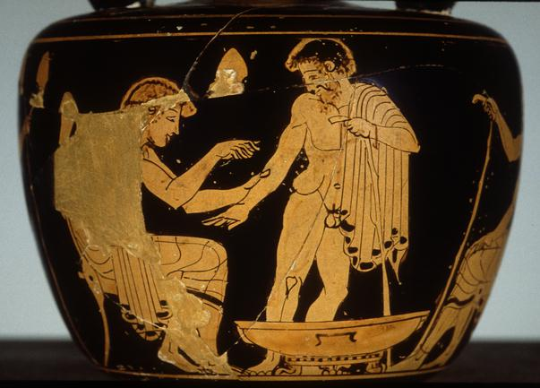
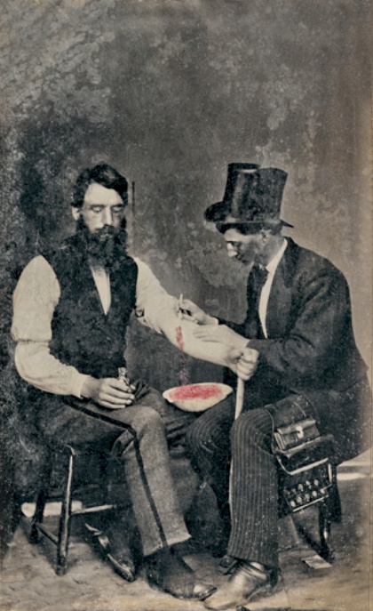
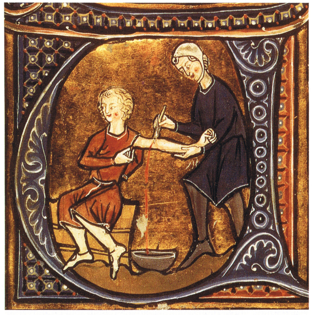
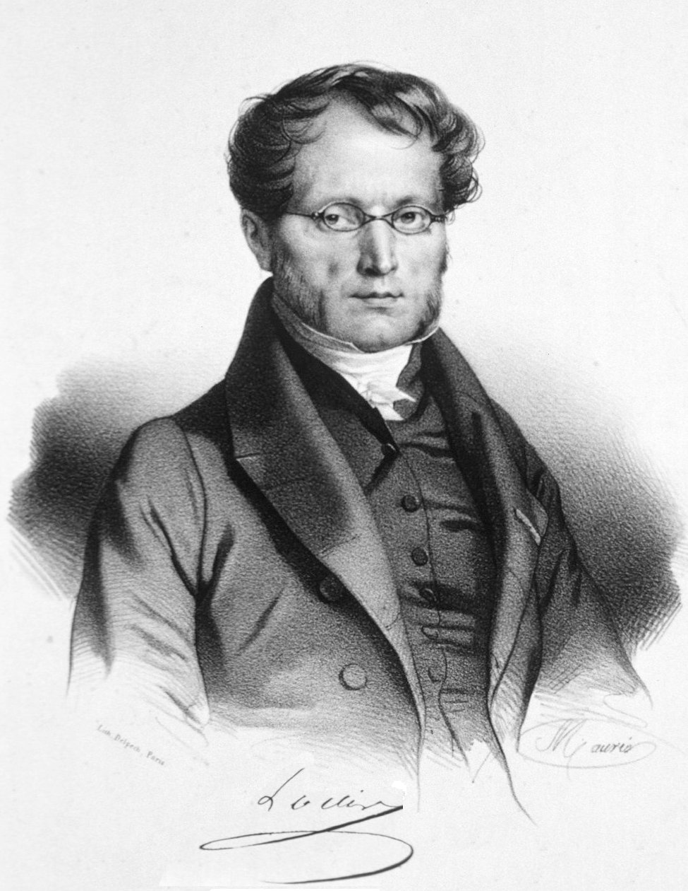
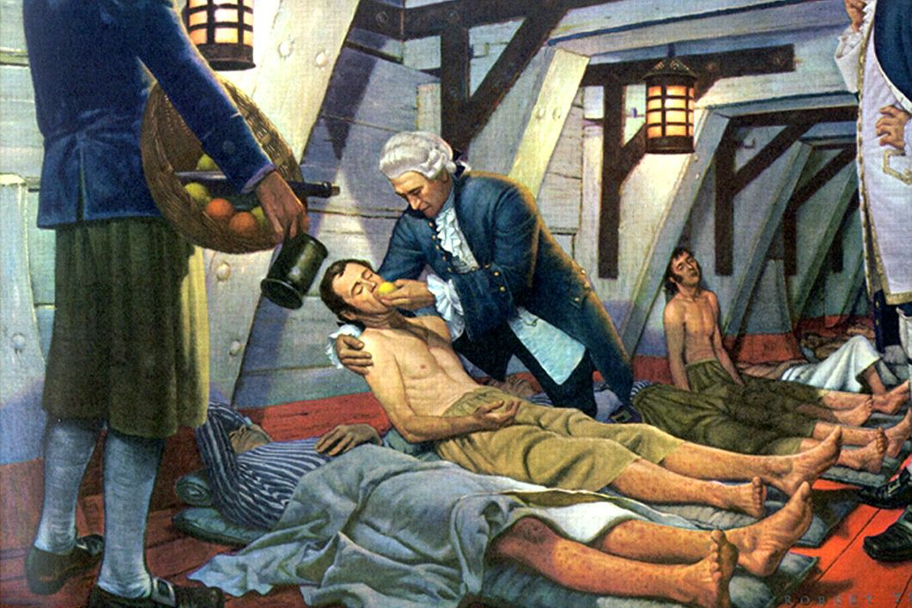

# Bevezető gondolatok, és pár történeti szempont
\chaptermark{Bevezető gondolatok}

Nemrégiben egy cikket olvashattunk az egyik népszerű tudományos magazinban, mely egy érdekes orvosi eredménnyel indított: egy svéd egyetem kutatói félmillió gyermek környezetét vizsgálták meg, és azt találták, hogy ahol magasabb a légszennyezettség, ott több a mentálisan beteg gyermek. A légszennyezés tehát mentális betegséget okoz! Vagy mégsem...?

Az orvostudomány egy jelentős része ilyen, és ehhez hasonló kérdésekre igyekszik választ adni: okoz-e mentális betegséget a légszennyezés? A mobiltelefon-használat agydaganatot? A vöröshús-fogyasztás vastagbélrákot? A császármetszéssel születés megnöveli-e annak kockázatát, hogy a gyermeknek később 1-es típusú cukorbetegsége lesz? És ha az anya paracetamolt szed a terhesség alatt, attól lehet a gyermek autista? Itt van ez az új vérnyomás-csökkentő gyógyszerjelölt, vajon csökkenti-e tényleg a vérnyomást? És okozhat-e alvászavart mellékhatásként?

E kérdésekre számos módszerrel kereshetjük a választ. Alapul vehetünk biológiai (élettani, kórélettani) megfontolásokat, kereshetünk állatmodelleket, amik lehetővé teszik a jelenségek vizsgálatát, tekinthetünk analóg példákat más területről, gyárthatunk matematikai modellt, azonban a jelen cikksorozat tárgya egy más jellegű, ám egyre fontosabb módszer: az empirikus vizsgálat. Az empirikus annyit tesz: „tapasztalati”, úgyhogy rögtön pontosítanom kell: a legrosszabb orvosi megismerési módszerek is tapasztalatokon alapulnak, ezért talán jobb, ha úgy mondjuk: szisztematikus empirikus vizsgálat. Empirikus, mert az alapján próbáljuk megválaszolni a kérdést, hogy begyűjtünk tényadatokat gyermekek környezetének légszennyezettségéről és a tényleges megbetegedéseikről, és szisztematikus, mert ezt nem ötletszerűen, hanem valamilyen terv szerint tesszük. A kérdés tehát adott: miután megvannak ezek az adatok, hogyan következtethetünk azokból arra, hogy okoz-e mentális betegséget a légszennyezés? Látni fogjuk a következőkben, hogy az e kérdés megválaszolásához vezető úton nagyon sok csapda van elrejtve...

Számos esetben persze nem lehetséges, vagy felesleges az empirikus kipróbálás, hiszen az egyéb bizonyítékokat is elégségesnek gondoljuk. Urológusok emberemlékezet óta tanácsolják, hogy sok folyadékot kell inni a vesekő megelőzésére -- de kipróbálta-e bárki is empirikusan, hogy ez tényleg csökkenti-e a vesekő előfordulását?! Ugyan már! De minek is, a vesekőről tudjuk, hogy a túltelítődő vizelet talaján alakul ki (biológiai megfontolás), a sok folyadékivás pedig megakadályozza ezt, mivel csökkenti a vizelet sűrűségét (más tudományterületről vett ismeret) -- tehát a sok folyadékivás nyilván csökkenti a vesekő kockázatát.

Az óvatosság persze mindig indokolt -- sok történelmi példát lehetne hozni, amikor a „nyilvánvalóan jó” (és ezért empirikusan ki sem próbált) tanácsok bizonyultak nem is annyira jónak... Ennél ráadásul sokkal rosszabb dolgok is történhetnek akkor, ha a más jellegű alátámasztások sem túl acélosak.

## Az érvágás esete, avagy hogyan lehet valamit 2000 éven át rosszul csinálni úgy, hogy senkinek nem tűnik fel
\sectionmark{Az érvágás esete}

Erre -- némiképp ironikus módon -- a legjobb példát pont az orvostörténelem egyik legáltalánosabban használt gyógyító beavatkozása jelenti: az érvágás. Az \@ref(fig:ervagas). ábrán láthatjuk az eljárás néhány ábrázolását, és ha jobban megnézzük, akkor nem sok kétségünk maradhat az előbbi állítás igazságtartalma felől. Elképesztő az időbeli átfogás (láthatunk érvágást ókori görög vázán *és* fényképen is!), szinte teljes a térbeli elterjedés (használták keleten, használták a görög orvosok, használták az arab orvosok, használták a középkori és reneszánsz Európában), röviden szólva: legkevesebb kétezer éven keresztül gyakorlatilag minden kultúra orvoslása alkalmazta az érvágást a legkülönfélébb betegségek gyógyítására.

```{r ervagas, fig.cap='Érvágás: görög vázán, kb. Kr. 470-480 (bal fent), fényképen, 1860 (jobb fent), iráni edényen, Kr. u. 1250 körül (bal lent), középkori kódexen, késői 13. század (jobb lent)', fig.show='hold', out.width='40%'}


knitr::include_graphics("abrak/AzOrvosiMegismeresModszertana_1_Abra1C_small.jpg")

```

Miközben ma már elég világosan tudjuk, hogy a legtöbb betegség esetén minimum nem tesz jót, ha a beteget kivéreztetik... Akkor meg mégis, hogyan lehet, hogy ez vált az orvostörténelem legszélesebb körben alkalmazott gyógyító eljárásává? A válasz nagyon rövid: azért, mert senki nem próbálta ki, hogy használ-e. Senki. Nem lehet azt mondani, hogy nem „empirikus alapon” használták, ellenkezőleg, a legfontosabb indok az volt, hogy a „tapasztalataink szerint” működik, ám a „tapasztalataink szerint” magyarra lefordítva azt jelenti, hogy a „benyomásaink szerint” -- márpedig az ilyen benyomások rettenetesen hibásak lehetnek. Az érvágást a benyomások támasztották alá, valamint az támasztotta alá, hogy „a mestereinktől így tanultuk” (és emiatt így szoktuk meg), hogy a legnagyobb szaktekintélyek ajánlják... szisztematikus vizsgálat tárgyává azonban senki sem tette az érvágást.

Egészen 1828-ig. (1828-ig! -- miközben már az ókorban is használták!) Ekkor egy Pierre-Charles-Alexandre Louis nevű francia orvos, az orvostörténelemben először, *kipróbálta*, hogy működik-e az érvágás (\@ref(fig:louis). ábra).

```{r louis, fig.cap='Pierre Charles Alexandre Louis (1787-1872).'}

```

Fogott 77 beteget, akit a La Charité kórházban kezeltek tüdőgyulladással (ebben a betegségben a kor orvosi gyakorlata szerint nem is volt kérdés, hogy érvágást kell alkalmazni, mindegyiknél meg is tették), ám Louis doktor kettéosztotta őket a szerint, hogy korán, 4 napon belül, vagy pedig későn, 4 napon túl hajtották-e végre az első érvágást. És láss csodát: a 41 beteg közül, akik pechükre a korai érvágásos csoportba kerültek, 18 halt meg (44%), a 36 beteg közül -- akiknek volt egy kis idejük előbb spontán gyógyulni -- pedig 9 (25%). A különbség majdnem kétszeres -- és ebben a pillanatban, 2000 év után, az érvágás elkezdett kikerülni az orvosi gyakorlatból. (Nagyon jellemző, de külön tanulmány tárgya lehetne, hogy erre még ez után is majd' száz évet kellett várni...) Ez a történet gyakran eszembe jut, amikor olyanokat hallok, hogy „ezt az eljárást már kétszáz éve használják, kiderült volna, ha nem is működik!”...

Louis kutatásának számos limitációja volt, de a munkájában az a fantasztikus, hogy még ezekre is, legtöbb esetben mai szemmel nézve is teljesen helytállóan, rámutatott. Sok vita folyik arról mind a mai napig, hogy az orvosi döntéshozatalban mekkora szerepe lehet, legyen a szisztematikusan gyűjtött empirikus bizonyítékoknak, és mennyi az orvos nem-szisztematikus tapasztalatainak, benyomásainak. Anélkül, hogy ebben állást foglalnék, remélem a fenti példa legalábbis intő figyelmeztetés a benyomásokra, „így tanultam és így szoktam meg”, „híres orvosoknak is ez a véleménye” típusú bizonyítékokra történő alapozás kapcsán.

## Empirikus megismerés az orvostörténetben

Az empirikus orvoslás története nagyon régi is, meg nagyon új is.

Az első említése valószínűleg sokak számára meglepő, úgyhogy hadd idézem szó szerint: „10 És mondá az udvarmesterek fejedelme Dánielnek: Félek én az én uramtól, a királytól, aki megrendelte a ti ételeteket és italotokat; minek lássa, hogy a ti orcátok hitványabb amaz ifjakénál, akik egykorúak veletek? és így bűnbe kevernétek az én fejemet a királynál. 11 És mondá Dániel a felügyelőnek, akire az udvarmesterek fejedelme bízta vala Dánielt, Ananiást, Misáelt és Azariást: 12 Tégy próbát, kérlek, a te szolgáiddal tíz napig, és adjanak nékünk zöldségféléket, hogy azt együnk, és vizet, hogy azt igyunk. 13 Azután mutassák meg néked a mi ábrázatunkat és amaz ifjak ábrázatát, akik a király ételével élnek, és aszerint cselekedjél majd a te szolgáiddal. 14 És engede nékik ebben a dologban, és próbát tőn velük tíz napig. 15 És tíz nap múlva szebbnek látszék az ő ábrázatuk, és testben kövérebbek valának mindazoknál az ifjaknál, akik a király ételével élnek vala.”

Ez az idézet Dániel könyvének 1. fejezetéből származik a Bibliából (Károli Gáspár fordítása); történészek a Kr. e. 2. századra teszik a szöveg keletkezését.

Noha vannak bizonyos problémái (nem világos, hogy Dániel beszerezte-e a Regionális Kutatásetikai Bizottság engedélyét, hogy az alanyok teljes írásos tájékozott beleegyezéssel vettek-e részt a kutatásban, hogy Dániel előzetesen regisztrálta-e a kutatást nemzetközi adatbázisban, az eredményközlés elégtelen, nem derül ki, hogy a hatás milyen statisztikai próbával került vizsgálatra stb.), mégis egy szempontból egészen fantasztikus, ami ide le van írva: felmerült a gondolat -- még egyszer, Kr. e. 2. században vagyunk! --, hogy egy orvosi kérdést empirikus alapon döntsenek el. Nem benyomás alapján, mint az előbbi példában láttuk, nem mesterek hagyományai, szent iratok vagy vakszerencse alapján, hanem szisztematikus empirikus vizsgálattal.

Ez a gondolat, bár helyenként felbukkant az orvostörténetben, lényegében kétezer évre feledésbe merült és -- egy-két említéstől eltekintve -- csak a 18. századtól kezdve jött újra elő. A leghíresebb -- bár egy-két részletében ma már vitatott -- példa James Lind angol hajóorvos vizsgálata a skorbutról, 1747-ből. Lind a skorbut ellenszerét keresve egy hajóúton a HMS Salisbury hajó 12 beteg tengerészét 6 kétfős csoportra osztotta, és -- egyebekben ugyanolyan táplálkozás mellett -- mindegyiknek olyan szert adott, amellyel kapcsolatban felmerült a lehetőség, hogy gyógyítja a skorbutot. (Két tengerész szerencsétlenségére ezek között volt a hígított kénsav is...) Csakhogy az egyik csoport narancsot és citromot kapott -- az ezekkel kezelt mindkét tengerész már 6 nap után sokkal jobban lett, az egyik szinte meg is gyógyult; semelyik másik csoportban sem tapasztalt ilyet Lind (\@ref(fig:lind). ábra).

```{r lind, fig.cap='James Lind: A skorbut legyőzője. Robert A Thom festménye.', out.width='70%'}

```

Ha jobban megnézzük, akkor világos, hogy ez szinte tökéletesen másolja Dániel könyvének leírását. Gondoljunk bele, majdnem pontosan 2000 év kellett ahhoz, hogy valaki először tényleg jól dokumentáltan végrehajtsa ezt egy konkrét orvosi probléma vizsgálatára!

Louis, Lind és társaik minden erőfeszítésével együtt is azonban e gondolatok igazán csak a 20. századra értek be, és kezdték egyre jobban formálni az orvosi megismerést.

## Vita egy állásponttal

A bevezetést hadd zárjam egy kissé szubjektív gondolattal. Egy vitában mondták ezt egyszer nekem: „Én nem hiszek az ilyen statisztikai dolgoknak, én a saját tapasztalataimnak hiszek”. (A vitapartner az „ilyen statisztikai dolgok” alatt természetesen igazából nem statisztikai dolgokat értett, hanem a szisztematikus empirikus kutatásokat.) Nem amellett akarok érvelni, hogy miért nem igaz ez a mondat -- elvégre ez inkább egy vélemény --, hanem, hogy miért hamis már a kiindulópontja is.

Tény, hogy napjainkra az orvosi kutatások, különösen épp a szisztematikus empirikus vizsgálatok a legtöbb ember számára nehezen követhető, zavaros matematikai részletekkel teletűzdelt, átláthatatlan dolgokká váltak; ennyiben érthető a fenti álláspont, hogy az ember jobban bízik a „saját tapasztalatában”. Rettenetesen fontos azonban rögzíteni, hogy a valóságban ezek nem szembenálló dolgok, épp ellenkezőleg: a kutatásokban hajszálpontosan ugyanúgy saját tapasztalatok vannak! Minden kutatásban szereplő adat valakinek a „saját tapasztalata”! Csak épp egyrészt nagy mennyiségben összegyűjtve, másrészt szisztematikus összegyűjtve. A mennyiség azért fontos, mert egy sor kérdés pontos vizsgálatához olyan nagy mennyiségű adatra van szükség, amennyit többé már nem lehet egyénileg begyűjteni, illetve ránézésre áttekinteni. Hány emberről tudunk személyesen tapasztalatot szerezni, illetve azt észben tartani és értékelni? 100? 200? Ez megfelelő lehet akkor, ha annyira drámai a hatás, mind Lind kutatásában, ahol már 2 matróz elég volt a kimutatásához, de reménytelenül kevés akkor, ha valamilyen kevesebb embert érintő, vagy kevésbé drasztikus hatást eredményező tényezőt kell vizsgálnunk. Ekkor sok ember adatait kell begyűjtenünk, amelyek aggregálásához azonban már elkerülhetetlen valamilyen statisztikai módszer alkalmazása, hiszen többé már nem tekinthetőek át szabad szemmel az adatok.

Még tanulságosabb azonban a második szempont: a szisztematikusság. Elvégre már az érvágás kapcsán is feltehettük volna a kérdést, hogy ugyan végül is miért nem vették észre, hogy a beavatkozás nagyon nem működik (sőt)...? A kutya a szisztematikusságnál van elásva. Konkretizálva, két fontos problémához vezet a szisztematikusság hiánya, amelyek tipikusan megjelennek az ilyen „tapasztalataim szerint” jellegű kijelentésekben.

Az egyik: a kontrolláltság hiánya. Lehet, hogy az érvágás után nagy arányban haltak meg a betegek, de ezt nem volt mihez viszonyítani: érvágásban nem részesülő kontrollcsoport híján ez akár még jó eredmény is lehetett volna! (Ha érvágás híján még többen haltak volna meg.) Kontrollálás hiányában egész egyszerűen nem is lehetett tudni, hogy ez az eredmény jó vagy rossz! Ez tükröződik vissza milliónyi hétköznapi kijelentésünkben, melyeket egészségügyi hatások kapcsán teszünk. „Bevettem a gyógyszert, és két nap múlva el is múlt a megfázásom!” (A legtöbb ember számára ez azt jelenti, hogy hat a gyógyszer, miközben fogalmunk sem lehet, hogy mi történt volna gyógyszerbevétel nélkül! Ha három nap múlva gyógyultunk volna meg, akkor tényleg hatott a gyógyszer, ha két nap múlva, akkor nem ért semmit, ha egy nap múlva, akkor egyenesen lassította is a gyógyulást -- miközben a fenti helyzet mindhárom eshetőséget lehetővé teszi!) „10 ember lett cukorbeteg azok közül, akik ilyen gyógyszert kaptak!” (Ha gyógyszer híján közülük csak 5 lett volna cukorbeteg, akkor tényleg a gyógyszer a ludas, ha 10, akkor semmi köze nem volt a megbetegedésükhöz, ha 15, akkor még védett is ellene... Megint csak, nem arról van szó, hogy a 10 ne lenne igaz, hanem arról, hogy a 10-től még a három lehetőség mindegyike fennállhat!)

A másik problémát a nem szisztematikus módszerek kapcsán a különféle kognitív torzítások jelentik. Ilyenből milliónyi létezik; legjobban talán a megerősítési torzítás példáján magyarázható el, hogy miről van szó. Röviden: az emberek hajlamosak jobban emlékezni az olyan példákra, amik megerősítik az előzetes elgondolásaikat, mint amik szembemennek velük. Ha tehát az ember „tapasztalataim szerint” alapon nyilatkozik, akkor -- teljesen önkéntelenül, félreértés ne essék, tudattalan módon! -- hajlamos arra, hogy azokra a példákra, amik egybevágnak az előzetes várakozásaikkal, emlékezzen, azokra viszont, amik cáfolnák azt, nem vagy kevésbé. Tehát amikor felidézzük, hogy „tapasztalataink szerint” hatott-e az érvágás (úgy, hogy ezt tanították a mestereink, mindenki más is ezt csinálja stb.), akkor kitűnően fogunk emlékezni azokra az esetekre, amikor a páciens hamar meggyógyult a beavatkozás után, és sokkal kevésbé azokra, amikor nem. Pontosan ugyanez játszódik le akkor, amikor nem szisztematikusan, hanem benyomásaink alapján gyűjtjük össze azokat az eseteket, amikor bevettük a gyógyszert és utána elmúlt a megfázásunk, feltéve, hogy erősen hiszünk benne, hogy hat a szer, vagy erősen hiszünk benne, hogy nem; amikor nem szisztematikusan gyűjtjük össze azokat az eseteket, amikor olyanról hallottunk, hogy valaki cukorbeteg lett a gyógyszert szedők közül, feltéve, hogy erősen hiszünk benne, hogy a betegséget a gyógyszer okozta, vagy erősen hiszünk benne, hogy nem. Újra fontos hangsúlyozni, hogy itt nem félrevezetésről vagy csalásról van szó, ez egy tisztán pszichológiai jelenség, ami elkerülhetetlenül jelentkezik akkor, ha nem szisztematikus módon dolgozunk (lévén, hogy a szisztematikus munka -- bár egyébként nem teljesen érzéketlen az ilyen jellegű torzításokra! -- legalábbis kevésbé érzékeny erre).

Félreértés ne essék, a szisztematikus empirikus vizsgálatoknak is vannak hátrányaik. Csak hogy a legkézenfekvőbbet említsem: a nagy, átfogó vizsgálatok gyakran igen költségesek, és előfordul, hogy e költségeket olyan szereplő -- például gyógyszergyár -- állja, aki anyagilag érdekelt abban, hogy egy adott eredmény jöjjön ki a kutatásból. Szó nincs arról, hogy erre ne lehetne rámutatni, épp ellenkezőleg, nagyon fontos, hogy e kérdésekről beszéljünk (én is sokszor meg fogom tenni a cikksorozatban), pont azért, hogy javítani lehessen az ebből fakadó torzításokat. De azt is világosan látni kell, hogy e rendszernek, minden hibájával együtt is, az alternatívája az, amikor 2000 évig nem tűnik fel, hogy az érvágás nem hatásos!

Louis egyik méltatója e szavakkal mutatta be művét 1836-ban az amerikai közönségnek: „[...] a tudományunkban [az orvoslásban] új korszak kezdődött azzal, hogy Louis bevezette a numerikus rendszernek nevezett eljárását. Végre megérkezett a valódi fény. Végre ráléptünk a biztos és nyílegyenes útra.” Mint az ki fog derülni, ez az út azonban végül is sajnos néha bizonytalannak, és szinte mindig meglehetősen kacskaringósnak bizonyult...