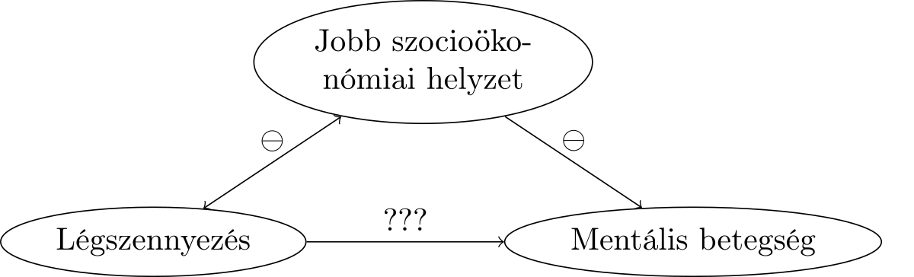
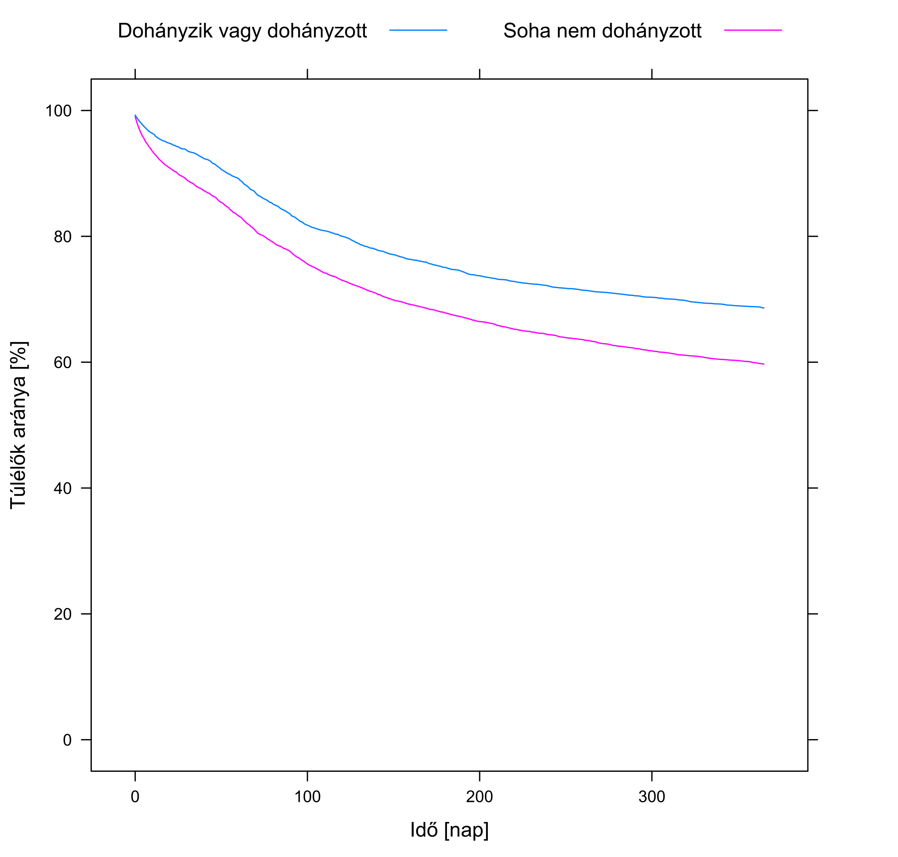
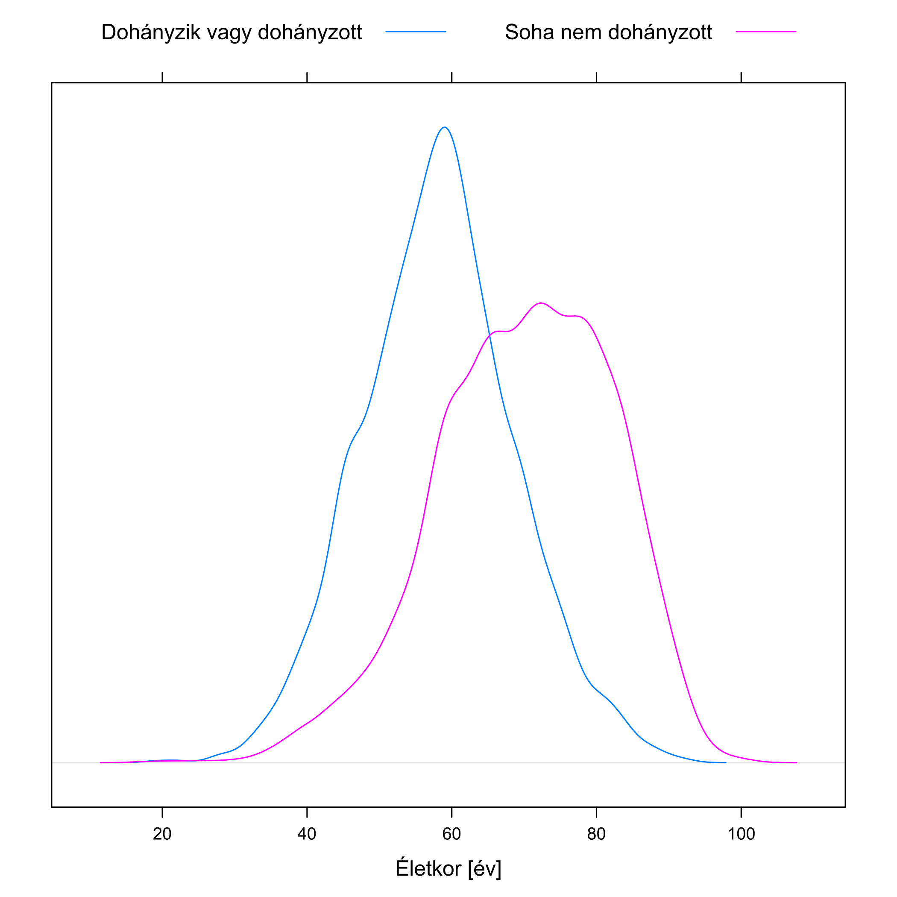
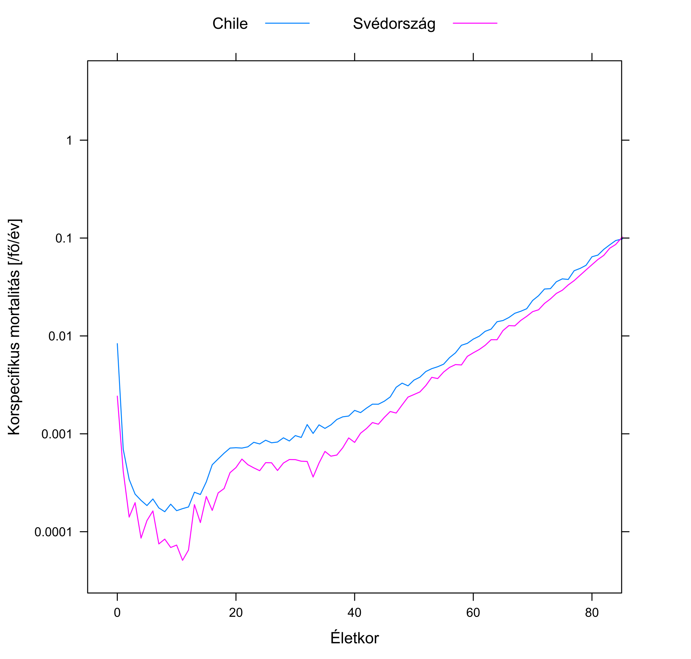
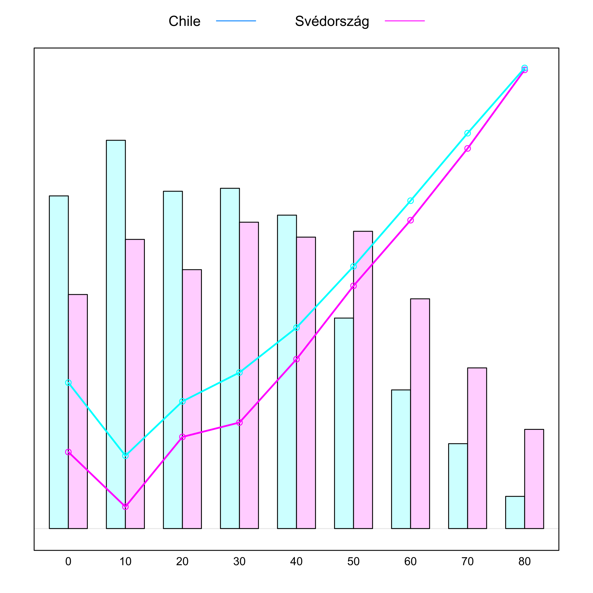

# Az empirikus megismerés alapgondolata és a confounding
\chaptermark{Alapgondolat, confounding}

Láttuk, hogy milyen veszélyeket rejthet magában, ha nem empirikusan, azaz tapasztalati úton vizsgálunk egy orvosi kérdést. Nem véletlen, hogy az utóbbi évtizedekben egyre jobban előtérbe kerültek a szisztematikus, empirikus vizsgálatok -- csakhogy ezek értelmezése szintén számos csapdát tartogat! Úgyhogy térjünk vissza a kiindulóponthoz, az említett cikkhez: okoz-e mentális betegséget a légszennyezettség?

Első ránézésre könnyű dolgunk van: empirikusan dolgozunk ugyebár, ezért begyűjtünk tényadatokat gyermekek lakóhelyének légszennyezettségéről, és esetleges későbbi megbetegedéseikről. Szisztematikusan dolgozunk, ezért a mintavételt alkalmas terv szerint végezzük, például a népességnyilvántartó adataiból teljesen véletlenszerűen választunk ki kellően sok gyermeket. (Tehát véletlenül sem internetes kérdőívet küldünk ki, többek között a „Megbetegítették a gyermekemet a légszennyezettséggel!!!” Facebook-csoport tagjainak, megkérve, hogy idézzenek fel az összefüggést megerősítő illetve cáfoló példákat.)

A kapott eredmények, a példa kedvéért: a 100 ezer nem légszennyezett helyen élő gyermek közül 1310-nél lépett fel mentális betegség, a 100 ezer légszennyezett környezetben felnövő közül azonban 3750-ben. A különbség drámai. Márpedig szisztematikusan dolgoztunk, a lehető legjobban: véletlenszerűen választott adatokkal, empirikusan vizsgáltuk a kérdést, ráadásul igen nagy mintán, úgyhogy hátradőlhetünk és nagy nyugalommal mondhatjuk: a légszennyezettség mentális betegséget okoz!

Vagy mégsem?

## Az okozatiság nyomában

A válaszhoz induljunk egy picit távolabbról. Érdemes felidézni, hogy milyen szerteágazóak azok a -- fentihez hasonló -- kérdések, melyekre választ szeretnénk adni az orvostudományban: Okoz-e agyrákot a mobiltelefon használata? A vörös hús fogyasztása vastagbélrákot? A császármetszéssel születés megnöveli-e annak kockázatát, hogy a gyermeknek később 1-es típusú cukorbetegsége lesz? És lehet-e a gyermek autista attól, hogy az anya paracetamolt szed a terhesség alatt? Itt van ez az új vérnyomáscsökkentő gyógyszerjelölt, vajon tényleg csökkenti-e a vérnyomást? Okozhat-e alvászavart mellékhatásként?

Ebben a listában igyekeztem, teljesen szándékosan, a lehető legkülönbözőbb kérdéseket összegyűjteni, melyekben látszólag egyetlen közös pont sincs. Ezt azért tettem, hogy még meglepőbb legyen a következő kijelentésem: azt állítom ugyanis, hogy bármennyire is különbözőnek tűnnek, valójában kivétel nélkül az összes felsorolt kérdés mögött -- és milliónyi egyéb orvosi, egészségügyi kérdés mögött -- pontosan ugyanaz a séma van! Persze, a konkrét részletek nagyon eltérnek, de ha ezektől megtisztítjuk az egyes kérdéseket, akkor a mélyben minden esetben ugyanazt találjuk.

Az egyik komponens: minden kérdésben található valami, amit teljesen általános szóval *expozíciónak* fogunk hívni. Ez szó szerint „kitettséget” jelent, és tényleg azt is értjük alatta, hogy az alany ki volt téve valamilyen hatásnak. Ezt a legáltalánosabban értjük: a hatás lehet valami, amit szándékosan alkalmazunk az alanyon (pl. gyógyszert adunk neki), lehet valami, amit maga választ (pl. vörös húst fogyaszt), és olyasvalami is, aminek akaratán kívül van kitéve (pl. császármetszéssel született). Érdemes végignézni az összes előbbi példát, csakugyan mindegyikben azonosítható az expozíció, a mobiltelefon-használattól egészen a gyógyszerszedésig.

A másik komponens: minden kérdésben található valamiféle eredmény, kimenet -- ezt fogjuk *végpontnak* hívni. Ez lesz az orvosilag lényeges, általunk vizsgált történés; ismét csak, érdemes egy pillanatra visszanézni az előbbi listára, és mindegyik elemnél megkeresni ezt, az agyráktól az alvászavarig.

Ezzel megvan a séma két „oldala”, expozíció egyfelől, végpont másfelől, már csak egyetlen komponens hiányzik, amit vizsgálni akarunk minden ilyen és ezekhez hasonló kérdésben: az, hogy az expozíció és a végpont között van-e ok-okozati összefüggés. Szép szóval ezt hívhatjuk *kauzalitásnak*. Bármennyire is különbözőnek tűnnek a kérdések, e séma mindegyikre illeszkedik, mindegyikben azonosítható az expozíció, azonosítható a végpont, és mindegyikre igaz, hogy okozatiságot kutatunk.

De mit is jelent ez a fogalom? Kézenfekvő értelmezés, hogy megnézzük, hogy hány beteg volt a légszennyezéses csoportban, megnézzük, hogy hány lett *volna* köztük, ha minden más változatlan lett volna, *de* nem lett volna légszennyezés -- és a kettő különbség a légszennyezés hatása. Sajnos ezt a másodikat soha nem ismerhetjük, hiszen ez egy valójában létre nem jött, képzeletbeli helyzet. Éppen ezért jobb híján a nem légszennyezéses csoporthoz viszonyítunk, tehát nem *ugyanazon* csoport tényleges és képzeletbeli helyzetét vizsgáljuk, hanem két *különböző* csoport tényleges helyzetét viszonyítjuk *egymáshoz*. Lényegében azt mondjuk, hogy a nem légszennyezett környezetben felnövő gyermekek adatai mutatják, hogy mi lett *volna*, ha a légszennyezett környezetben felnövőknél nem lett volna légszennyezés.

Csakhogy ez egy nagyon erős feltevés: kizárólag akkor igaz, ha a két csoport semmi másban nem tér el, egyedül a légszennyezettség tényében.

A tételmondatot mindenesetre megfogalmazhatjuk: Az expozíció akkor van okozati összefüggésben a végponttal, ha a csak az expozícióban eltérő csoportok eltérnek a végpontban, mégpedig olyan mértékben, ami már nem tudható be a véletlen ingadozásnak.

(Az utolsó tagmondat magyarázatára később még vissza fogok térni. Egyelőre gondoljunk arra, hogy ha nem 100 ezer gyermek vett volna részt a kutatásban csak 100, és mondjuk azt találjuk, hogy az egyik csoportban 2, a másikban 3 beteg gyermek van, akkor sokkal óvatosabban mondanánk, hogy különbséget találtunk -- noha elvileg itt is másfélszeres az eltérés.)

## A confounding problémája

Ebben a tételmondatban tehát van egyetlen egy szó, ami iszonyatos bonyodalmakat okoz: az, hogy „csak”. Biztos, hogy az összehasonlított csoportjaink kizárólag csak az összehasonlítás tárgyában, tehát az expozícióban térnek el? Biztos, hogy a légszennyezett területen felnövő és az egészséges levegőben felnövő gyermekek között *csak és kizárólag* az a különbség, hogy milyen a levegőminőség a lakhelyükön...?

Dehogy! A nagyobb légszennyezettségű területek nagyon gyakran épp a városok peremkerületeit jelentik, az ipari negyedeket, az elavult fűtésű, leszakadt részeket. Itt azonban tendenciájában inkább rossz körülmények között élő, kevésbé tehetős családba született (egyszóval: rosszabb szocioökonómiai helyzetű) gyermekek fognak lakni. Igen ám, de a rosszabb szocioökonomiai helyzet egy sor betegség magasabb kockázatát hordozza -- mi van, ha a mentális betegségek is ezek közé tartoznak? Mert a rosszabb szocioökonómiai szegmensben a várandósok kevésbé férnek hozzá a szülés előtti gondozáshoz, közülük több dohányzik vagy fogyaszt alkoholt a várandósság alatt. A gyermekekre sem csak a rosszabb levegő hat, hanem a rosszabb táplálkozás, hogy kevésbé vesznek részt szűréseken és így tovább, és így tovább.

Innentől kezdve, ha találunk is különbséget a mentális megbetegedések előfordulásában a két csoport között, *nem tudhatjuk*, hogy az minek a következménye: az általunk vizsgált levegőminőségbeli eltérésnek, az ezzel -- *óhatatlanul!* -- *együttjáró* egyéb eltéréseknek, vagy esetleg ezek keverékének?! Ezt nem tudhatjuk -- hiszen az összehasonlított csoportok nem *csak* az összehasonlítás szempontjában tértek el.

A problémát tehát az jelenti, hogy a két változó kapcsolatát *megzavarja* egy harmadik változó, mely egyszerre hat az expozícióra *és* a végpontra, ahogy az \@ref(fig:confoundingsema). ábra is mutatja. Ennek következtében elképzelhető, hogy a légszennyezettségnek valójában *nincs is a világon semmilyen* hatása a mentális betegségekre, amit látunk, az egy *látszólagos* hatás, annak következtében, hogy a légszennyezett területen felnövő gyermekek körében egész egyszerűen több a rossz szocioökonomiai helyzetű, ami pedig a *valódi* oka a több mentális betegségnek!

```{r confoundingsema, fig.cap='Bal oldal: Naiv megközelítés, jobb oldal: valós helyzet.', fig.show='hold', out.width='40%'}


```

Ha valaki nem hiszi el, hogy ilyen létezhet, akkor nézze meg képzeletbeli adatgyűjtésünk részletesebb eredményeit, melyet a következő táblázat mutat:

                                  Légszennyezett       Nem légszennyezett   Összesen
  ------------------------------- -------------------- -------------------- --------------------
  Rossz szocioökonómiai helyzet   6% (3300/55000)      6% (375/6250)        6% (3675/61250)
  Jó szocioökonómiai helyzet      1% (450/45000)       1% (935/93750)       1% (1385/138750)
  Összesen                        3,8% (3750/100000)   1,3% (1310/100000)   2,5% (5060/200000)

Ebben a táblázatban valami első ránézésre egészen paradox dolog látható. (Azért írtam oda nem csak a százalékokat, de a számokat is, mert néhányan azt szokták mondani, hogy ez matematikailag is lehetetlen. Erről szó nincs, ha valaki nem hiszi, adja össze és ossza el a feltüntetett számokat!) Mert mit látunk? Azt, hogy a rossz szocioökonómiai helyzetű gyermekek körében *nincs* hatása a légszennyezésnek (így is, úgy is 6% az előfordulása), a jó szocioökonómiai helyzetű gyermekek körében *szintén nincs* hatása (1% így is, úgy is) -- összességében viszont *mégis* van! Hiszen az 1,3% megnőtt 3,8%-ra, ahogy azt a felvezetőben is írt számok mutatják. Ez meg hogy a csudában lehet? -- kérdezhetné valaki. Se egyik csoportban nincs hatása, se a másikban, de összességében mégis van?!

Rakjuk most össze, hogy mi is történt itt. A problémát az okozta, hogy volt egy változónk, mely *egyszerre* tudott két dolgot: *egyrészt* összefüggött az expozícióval (nézzük meg, a jó szocioökonómiai helyzetűeknek csak harmada élt légszennyezett területen, a rosszaknak majdnem 90%-a), *másrészt* befolyásolta a végpontot a légszennyezettségtől *függetlenül*, *önmagában* is (az 1%-os előfordulást 6%-ra emelte). Az ilyen változókat szokás zavaró változónak, vagy -- magyarul is gyakrabban használt angol kifejezéssel -- confoundernek nevezni; a jelenségnek magának pedig *confounding* a neve. (Ez egy nagyon találó angol kifejezés, amire sajnos nem honosodott meg hasonlóan frappáns magyar elnevezés. A „confounding” ugyanis szó szerint azt jelenti, hogy „egybemosódás”: a probléma valóban az, hogy az általunk vizsgált eltérés *egybe van mosódva* egy vagy több egyéb eltéréssel.)

Ez az oka annak, hogy a naiv módszer („több-e a mentálisan beteg a magasabb légszennyezettségű területeken?”) csábító mivolta ellenére is *teljesen fals*! Hiába is dolgoztunk empirikusan, és hiába is gyűjtöttünk szisztematikusan adatokat.

Fontos felhívni rá a figyelmet, hogy a „teljesen fals” természetesen nem azt jelenti, hogy az eredményünk akkor valójában azt jelenti, hogy nem okoz mentális betegséget a légszennyezettség -- természetesen okozhat, csak ez *nem következik* abból, hogy több a mentálisan beteg a szennyezettebb levegőjű területeken! *Önmagában* ez az együttjárás *nagyon kevéssé bizonyítja* az okozati összefüggést. Azt mondhatjuk, hogy nagyobb légszennyezettség *együtt jár* a több mentális betegséggel, de hogy a nagyobb légszennyezettség *okoz-e* több mentális betegséget, az egy sokkal-sokkal fogósabb kérdés, aminek kapcsán, mint a fentiek is mutatják, roppant óvatosan kell eljárni.

Ez az ilyen jellegű adatok értékelésének egyik legnagyobb problémája (mely a laikus sajtóban is lépten-nyomon visszaköszön). A valóságban ráadásul messze nem olyan egyszerű a helyzet, mint a fenti táblázatban, ahol van egy szem confounderünk. A valós helyzetek általában ennél sokkal-sokkal kuszábbak.

Ennek illusztrálására vegyünk egy másik példát a cikk elejének listájáról: a császármetszéssel születés megnöveli-e az 1-es típusú cukorbetegség kockázatát? A császármetszéssel születők között több az 1-es típusú cukorbeteg, de -- most már tudjuk -- ez nem sokat jelent, hiszen mi van, ha vannak egyéb eltérések is a csoportok között? Ez csakugyan így van: a \@ref(fig:t1dmsema). ábra mutatja, immár egy valós orvosi példán, a legfontosabb confoundereket ebben az esetben. Még itt se mondhatjuk persze, hogy ez az összes, de ez már valóságközelibb.

```{r t1dmsema, fig.cap='Okoz-e 1-es típusú cukorbetegséget (T1DM) a császármetszés? Potenciális confounderek és hatásaik.', out.width='90%'}
knitr::include_graphics("abrak/AzOrvosiMegismeresModszertana_2_Abra2.png")
```

Példának okáért, az anyai diabetes és a császármetszés közötti nyílon pozitív jel van, mert a cukorbeteg anyáknak általában nagyobbak a magzataik, és ez a különféle téraránytalanságok miatt gyakrabban vezet császármetszéshez. Másrészt a cukorbetegségnek van egy erős genetikai komponense, így az anyai cukorbetegségből a gyermekéhez is pozitív nyíl vezet. És már ennyi is elég, hogy bajban legyünk: innentől kezdve, még ha azt is találjuk, hogy a császármetszéssel születettek körében több lesz később cukorbeteg (egyébként tényleg ez a helyzet), akkor sem tudhatjuk, hogy mi a valódi ok: csakugyan a császármetszés, vagy egyszerűen csak az, hogy a császármetszéssel születőknek gyakrabban cukorbeteg az édesanyja? És ez még csak az első confounder volt!

Érdemes megnézni a másodikat, az anyatejes táplálást is. Ez rámutat arra, hogy az expozíció és a confounder között nem érdekes, hogy milyen az okozati kapcsolat iránya (az eddigi példákkal szemben itt most aligha arról van szó, hogy az anyatejes táplálás befolyásolja, hogy korábban császármetszés történt-e...), csak az fontos, hogy kapcsolat van. És csakugyan, a császármetszéssel szülő nők ritkábban táplálják anyatejjel a gyermeküket, ez így van a valóságban, és most az mindegy is, hogy ennek mi az oka. Másrészt az anyatejes táplálás -- számos egyéb előnye mellett -- csökkenti a cukorbetegség kockázatát is -- és akkor e ponton megint meg vagyunk lőve... és még közel nem vagyunk a sor végén.

## Zavaró változóktól a megzavart olvasókig

Nem véletlenül írtam korábban, hogy a naiv módszer nagyon „csábító” tud lenni. Képzeljük csak el, pláne némi marketinggel meghintve: látványos grafikon, rajta a nem légszennyezett területen felnövők körében a kockázat (kicsi oszlop), mellett a légszennyezett területek adata (oszlop kiüti az oldal tetejét), szomorú anyuka megrázó beszámolója mentálisan beteg gyermekéről, természetesen hangsúlyozva a levegőminőséget stb. stb. Vajon 100 emberből hánnyal hitetné el a légszennyezettség szerepét...? (És hányan mondanák azt, hogy „hohó, de hát itt óvatosnak kell lenni, mert a szocioökonómiai státuszon keresztül megvalósuló confounding van!”...?)

Ha jobban megnézzük, mindennapi egészségügyi megállapításainkat lépten-nyomon átszövi ez a probléma. Nézzük meg kedvenc internetes portálunk egészségügyi rovatát is...

„A több zöldséget fogyasztók 10 évvel tovább élnek!” Biztos, hogy a több zöldséget fogyasztók csak a zöldségfogyasztás mértékében térnek el a kevesebb zöldséget fogyasztóktól? Fogadjuk el, hogy igaz az állítás, és tényleg együtt jár a több zöldségfogyasztás a hosszabb élettartammal. Akkor végül is igaz ez a mondat, minek rajta kötözködni? -- kérdezhetné valaki. Szó nincs erről, ez nem akadékoskodás, éppen ellenkezőleg, ez a legfontosabb kérdés. A mondat nyilván azt akarja sugallani, hogy együnk több zöldséget, hogy tovább éljünk. De ha valójában az előző nem okozati kapcsolat, csak együttjárás, akkor -- mivel a valódi ok más volt -- ezzel *nem megyünk semmire*! Márpedig számunkra ez a fontos: ha egy ilyen cikket olvasva életünket úgy változtatjuk meg, hogy növeljük a zöldségfogyasztásunkat, akkor *várhatjuk-e ettől*, hogy megnő az élettartamunk?

A sor ugyanerre a mintára sajnos igen hosszan folytatható. „Az indiai konyha rengeteg curry-t használ, és lám, velünk szemben ott szinte ismeretlenek a gyulladásos bélbetegségek!” (Biztos, hogy India és Magyarország között csak és kizárólag az az egyetlen különbség, hogy a főzéshez más mennyiségű curry-t használunk?) „Azokban az amerikai államokban, ahol többet alszanak, kevesebb a depressziós!” (Biztos, hogy ezen amerikai államok csak és kizárólag az alvással töltött órák számában térnek el a többitől?) A legszebb, amikor ugyanazt eljátsszuk oda és vissza is: „30 éve még nem használták ilyen széles körben a vérnyomás-csökkentőket, és jóval több is volt a magas vérnyomásos beteg!” (Biztos, hogy 2018 és 1988 között az egyetlen különbség a vérnyomás-csökkentők használatának a mértéke?) „30 éve még nem használták ilyen széles körben a védőoltásokat, és jóval kevesebb is volt az autista!” (Biztos, hogy 2018 és 1988 között az egyetlen különbség a védőoltások használatának a mértéke?)

A jelenség egészen meglepő helyzetekben is felbukkanhat. A \@ref(fig:infarktus). ábra mutatja, hogy a magyar Nemzeti Szívinfarktus Regiszter 2013 és 2014 évi adatai -- több mint 20 ezer infarktus! -- szerint mik a túlélési kilátásai egy infarktuson átesett betegnek a szerint, hogy dohányzik-e vagy sem. Jól látható, hogy a dohányzók görbéje mindvégig a nemdohányzók felett halad, nem is kevéssel: az infarktus utáni túlélésben *jót tesz* ha dohányzunk!

```{r infarktus, fig.cap='Bal oldal: Túlélés infarktus után: a vízszintes tengelyen az infarktus óta eltelt idő, a függőleges tengelyen az adott időben még életben lévők aránya látható. Jobb oldal: Az infarktust elszenvedett betegek életkorának eloszlása.', fig.show='hold', out.width='40%'}


```

Vagy mégsem? Most már egész biztos mindenki rávágja: a dohányosok nem csak a dohányzás tényében térnek el a nem dohányosoktól! De még mennyire, hogy így van, számos más dologban eltérnek; a számunkra most legfontosabb az életkor: az ábra jobb oldala mutatja -- pontosan ugyanazon személyekre vonatkozóan! -- az életkor eloszlását dohányzás szerint. Gyönyörűen látható, hogy a dohányosok, egész mellbevágó módon, átlagosan mintegy 15 évvel *korábban* kapnak infarktust! Márpedig az infarktus utáni túlélésben az életkor egy rendkívül fontos tényező, így ez a 15 év bőven kompenzálja a dohányzás -- esetleges -- negatív hatását. (Esetleges, hiszen innentől kezdve nem tudhatjuk biztosan mi a helyzet: lehet, hogy dohányzásnak tényleg negatív a hatása, ahogy várjuk, de elvileg ettől még az is lehet, hogy nincs hatása, vagy akár lehet továbbra is pozitív, csak nem annyira, mint az az ábrából következne.)

Vagy vegyük a következő esetet! 2005-ben Svédországban 9 millió 10 ezer 729 lakosból 91 ezer 709 halt meg, így ott a halálozási ráta 10,2/ezer fő/év. Ugyanebben az évben Chile-ben 15 millió 519 ezer 347 lakosból 86 ezer 100 halt meg, azaz ott a halálozási ráta 5,5/ezer fő/év.

Micsoda? Svédországban *kétszer nagyobb* a halandóság, mint Chilében?! A dolgot még furcsábbá teszi, ha megnézzük az ún. korspecifikus mortalitásokat (\@ref(fig:svedchile). ábra), ami azt mutatja, hogy adott életkorban mekkora a halandóság.

```{r svedchile, fig.cap='Bal oldal: Halandóság adott életkorban Chilében és Svédországban. Jobb oldal: ugyanez 10 életévenként, a háttérben feltüntetve a két ország korfáját is.', fig.show='hold', out.width='40%'}


```

Jól látszik az emberi halandóság nagyon jellegzetes alakja: csecsemőkorban magas, de nagyon gyorsan leeső mortalitás (gyermekbetegségek fázisa), majd egy minimum -- már túlesett a gyermekbetegségeken, de még nem kezdődnek a felnőttkoriak -- után folyamatos, de lassú növekedés („elhasználódásos” mortalitás fázisa). Ami azonban számunkra most sokkal izgalmasabb, az a megfigyelés, hogy a svéd görbe mindvégig a chilei görbe *alatt* van! Azaz: minden életkorban jobbak a túlélési esélyek Svédországban!

Most akkor ez hogy is van? Minden életkorban jobbak a túlélési esélyek Svédországban, de összességében sokkal rosszabbak?!

Első ránézésre teljesen paradoxnak tűnhet, mi azonban már nem lepődünk meg rajta -- nyilván valamilyen confounding van a háttérben! Csakugyan: a két ország között egyéb eltérés is van; ami itt fontos lesz: a korfa. Amint azt az ábra jobb oldala mutatja is, a chilei lakosság sokkal-sokkal fiatalabb összetételében, mint a svéd, így amikor a teljes halandóságot számoljuk, akkor ott az -- előnyös -- fiatalkori értékek jóval nagyobb súllyal fognak latba esni, míg a svédeknél ezeknek kisebb lesz a súlya és a -- sokkal rosszabb -- időskori értékeknek lesz nagyobb. Így jöhet ki a fenti végeredmény (hiszen azért a chilei 20 éveskori halandóság még mindig jobb, mint a svéd 70 éves -- ezen múlik a jelenség). Ez tehát, bármennyire is máshogy hangzott első ránézésre, megint csak a confounding egy példája!

Most már itt az ideje, hogy átugorjunk a következő, nagyon kézenfekvő kérdésre: akkor mégis mit tegyünk, hogy e jelenség fényében is megbízható következtetéseket tudjunk levonni?