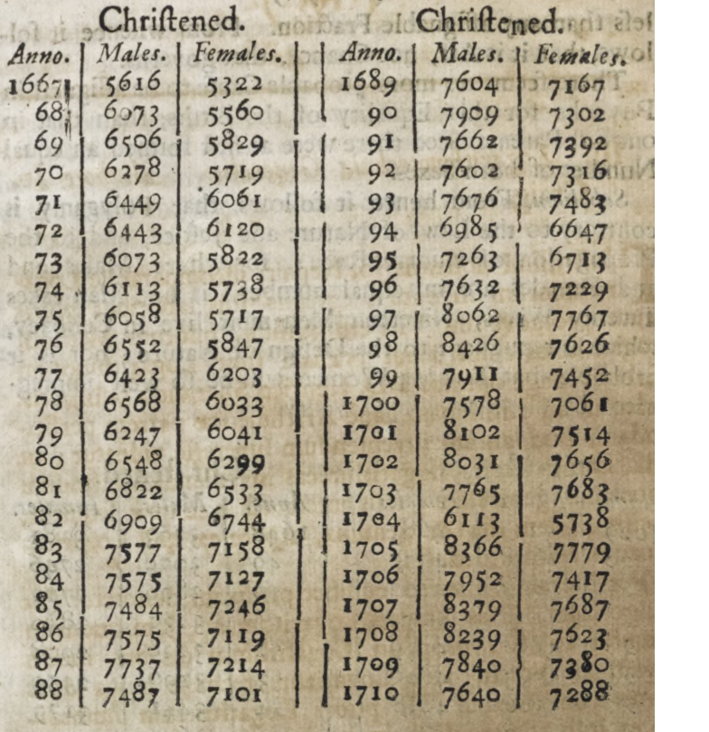
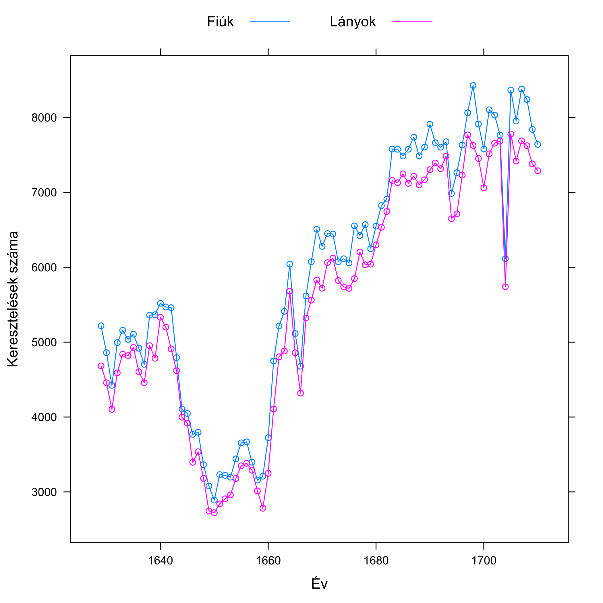
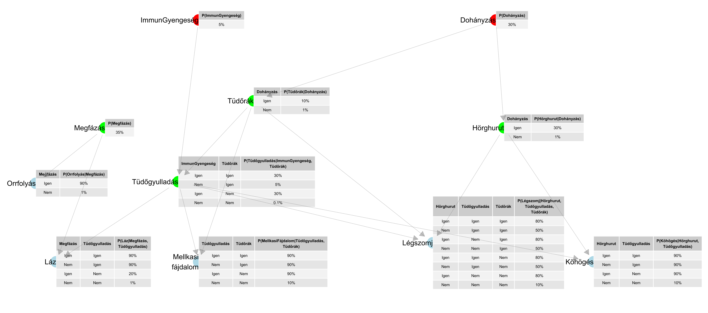
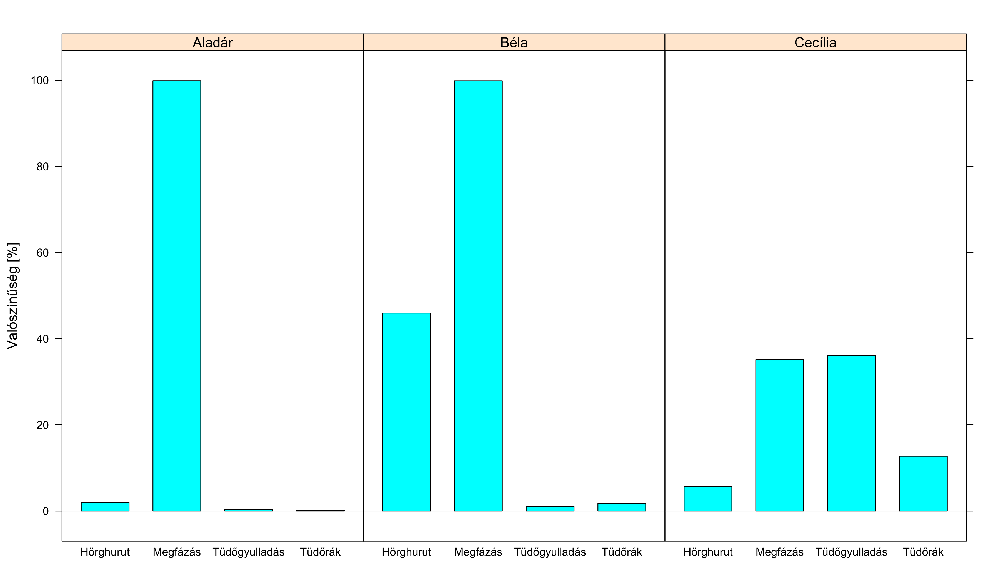
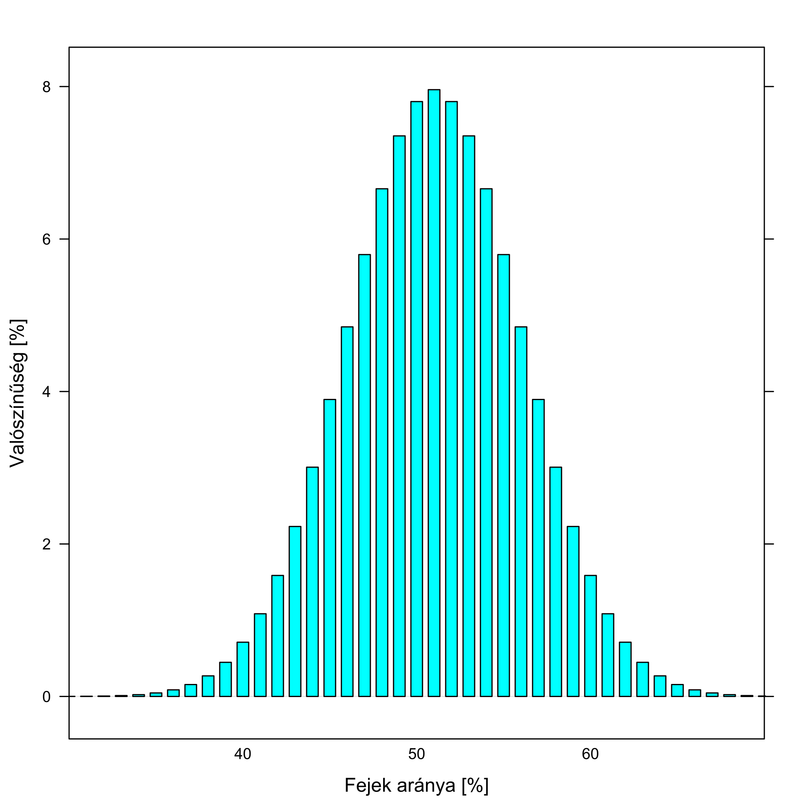
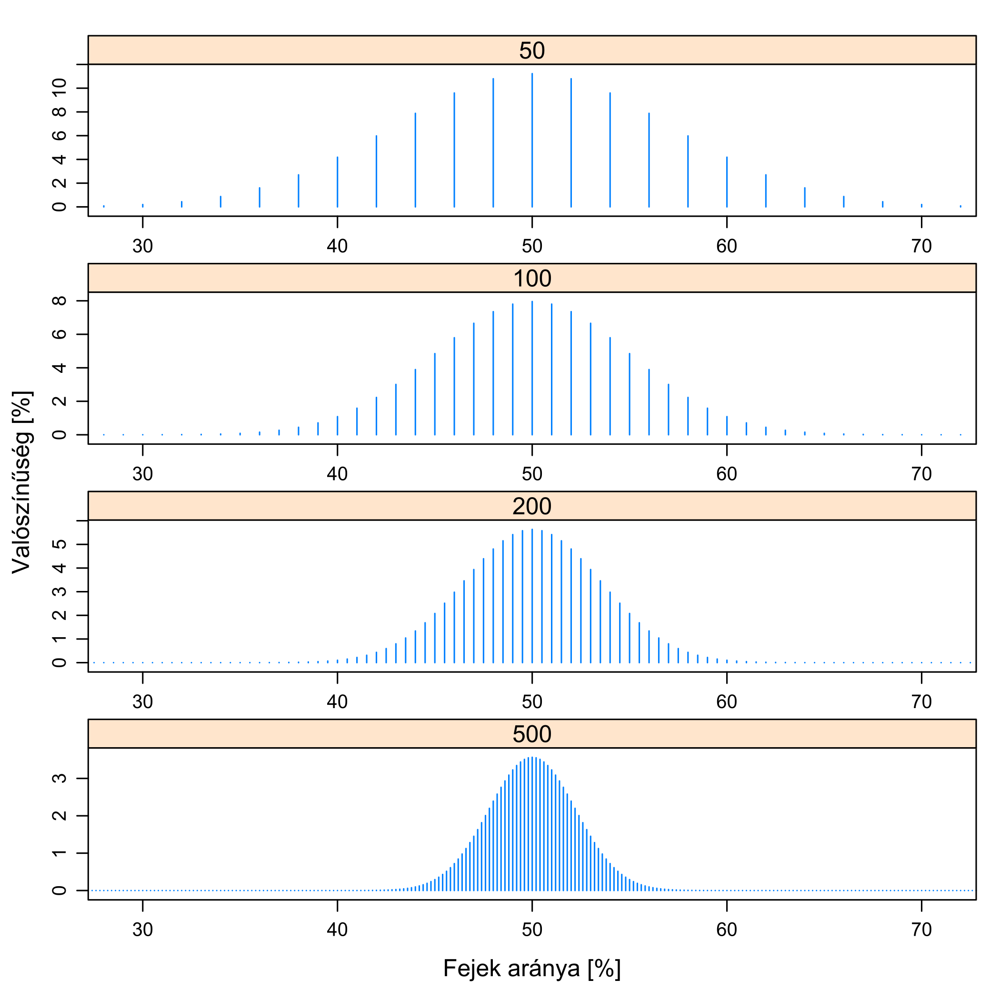
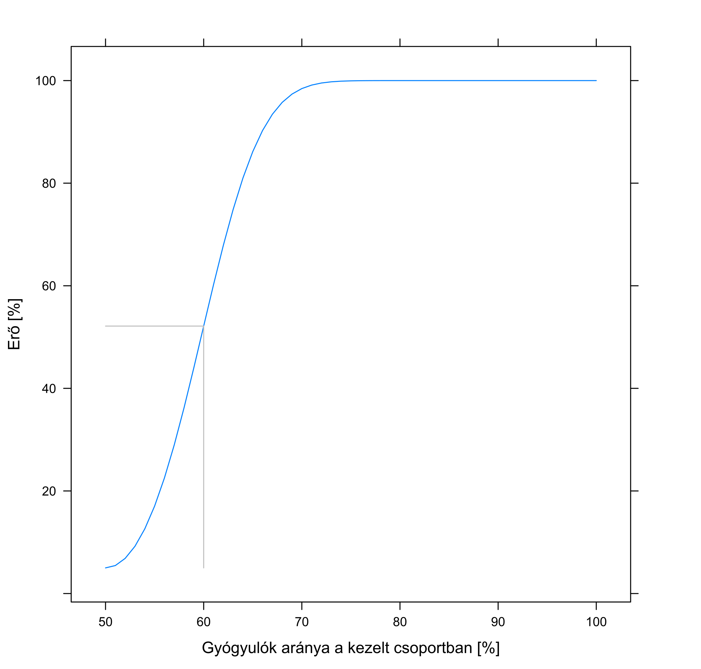
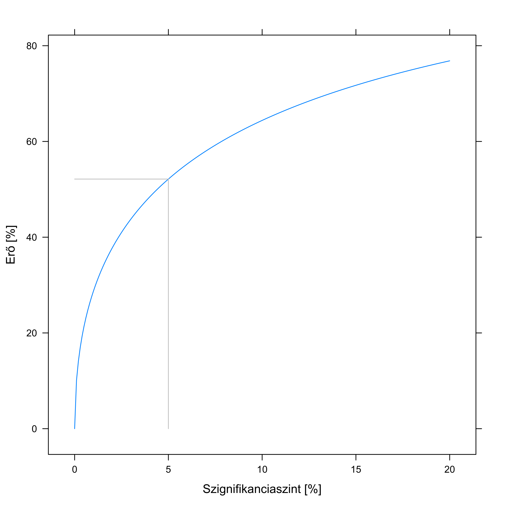
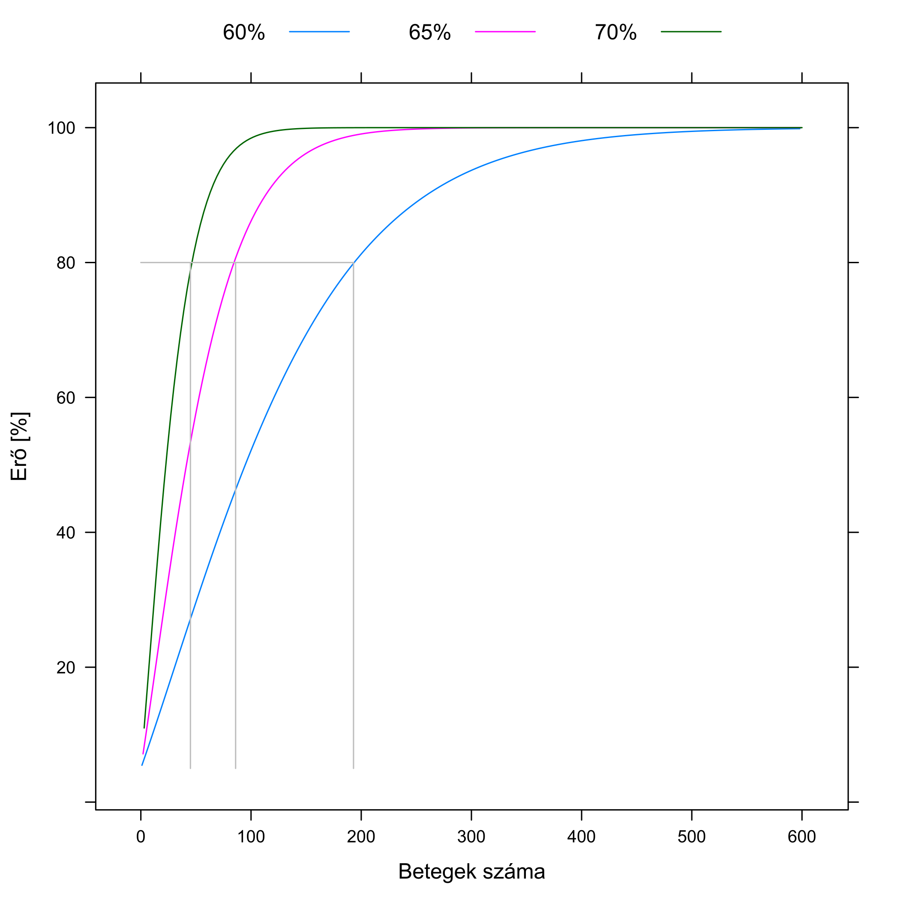
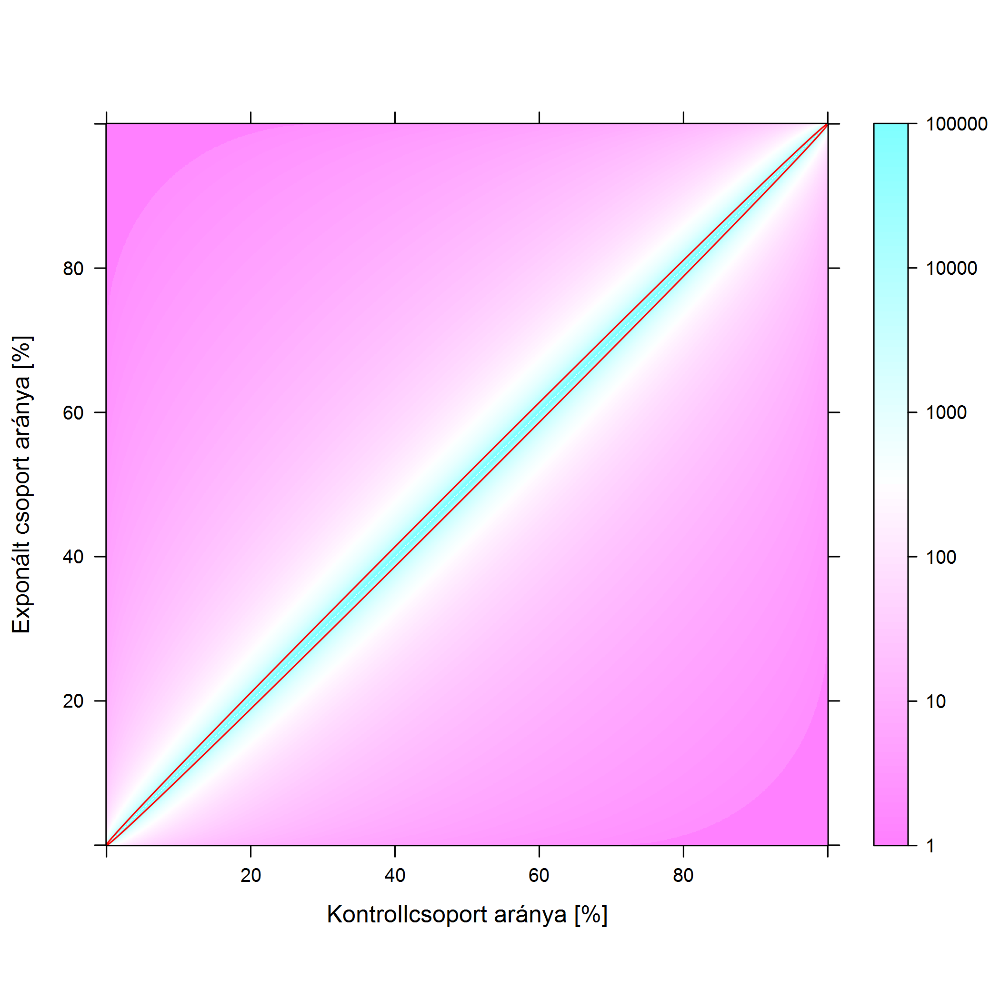

# A véletlen szerepe az orvosi vizsgálatok kiértékelésében
\chaptermark{A véletlen szerepe}

Láttuk, hogy ha kíváncsiak vagyunk arra, hogy egy tényező bír-e valamilyen egészségügyi hatással, akkor végezhetünk kísérletet és megfigyelést, és alaposan körbejártuk azt, hogy ez utóbbi esetében mire kell figyelni. Van azonban egy tényező, ami mind a megfigyeléseket, mind a kísérleteket érinti, de eddig még egyáltalán nem ejtettünk róla szót: a véletlen szerepe.

Emlékezzünk vissza a tételmondatunkra: Az expozíció akkor van okozati összefüggésben a végponttal, ha a csak az expozícióban eltérő csoportok eltérnek a végpontban, mégpedig olyan mértékben, ami már nem tudható be a véletlen ingadozásnak. Ennek az első felét alaposan kiveséztük (különös tekintettel a „csak” szóra!), de a második felével még adósak vagyunk. Egyáltalán, mit értünk e véletlen ingadozás alatt?

A véletlenség problémája abból fakad, hogy a biológiában a dolgok általában nem determinisztikusak. Mi az, hogy „nem determinisztikus”? Az, hogy a gyógyszerrel kezeltek nem fognak 100%-ban meggyógyulni, és hasonlóan, kezelés nélkül sem fog 100% belehalni a betegségbe. Ha ez így lenne, akkor semmiféle problémánk nem lenne a véletlenséggel: ha tudunk kísérletet csinálni, akkor összesen 2 beteg bevonásával biztos választ kaphatnánk a gyógyszer működőképességéről. Az egyik -- véletlenszerűen kiválasztott -- beteget kezeljük a gyógyszerrel, a másikat nem: ha a kezelt beteg meggyógyul és a nem kezelt meghal, akkor a gyógyszer *biztosan* hatott, minden más esetben a gyógyszer *biztosan* hatástalan (vagy kifejezetten káros). Abban a pillanatban azonban, hogy ez nem így van, gondban leszünk a 2 szem betegünkkel.

Mondjuk, hogy a kísérletünkben mindkettő meghal, kijelenthetjük-e ekkor, hogy a gyógyszer hatástalan? Nem! Tegyük fel, hogy kezelés nélkül 99% hal meg, kezeléssel 1%, azaz igen csak hatásos a szer. Ekkor 99% valószínűsége van annak, hogy a nem kezelt beteg meghal *mivel* nem kezeltük, és 1% valószínűsége, hogy a kezelt beteg meghal *annak ellenére,* hogy kezeltük. Hogy kézzelfoghatóvá tegyük ezeket a valószínűségeket, gondolatkísérletként képzeljük el, hogy 10 000-szer elvégezzük ezt a kísérletet. Ekkor várhatóan $10000 \cdot 99\% = 9900$ esetben meghal a nem kezelt beteg. Mivel a két beteg sorsa értelemszerűen teljesen független egymástól, ezért ezen a 9 900 eseten belül *is* 1% lesz azon esetek aránya, amikor a kezelt beteg meghal. Ez $9\ 900 \cdot 1\% = 99$ eset -- ennyiszer fordul elő, hogy a nem kezelt és a kezelt beteg egyaránt meghal (miközben a kezelés roppant hatásos volt!). Mivel erre 10 000 esetből került sor, így 99/10 000=0,99% ennek a valószínűsége. Összefoglalva: hiába volt *majdnem* biztos, hogy kezelés nélkül meghal a beteg, és *majdnem* biztos, hogy kezeléssel nem hal meg, már ez a „majdnem” is elég volt ahhoz, hogy többé ne tudjunk biztos állítást tenni. Mert nem tudunk: *biztosan* nem mondhatjuk mindkét beteg halálát látva, hogy a gyógyszer nem hat! Hiszen láttuk, ha hat, *akkor is* előfordulhat -- még ha csak szűk 1% valószínűséggel is --, hogy *mégis* meghal mindkettő. A két halálozás tehát nem jelenti *biztosan* azt, hogy nem hatott a gyógyszer. Ha ráadásul nem is ennyire hatásos a kezelés, akkor ez a valószínűség jóval nagyobb is lehet: ha 10% és 90% a két halálozási arány, akkor már 9% valószínűsége van annak, hogy mindkét beteg meghal (ellenőrizzük a számot!), noha a kezelés továbbra is hatásos.

A dolog fordítva is igaz: ha azt látjuk, hogy a kezelt túlélt, a nem kezelt meghalt, mondhatjuk-e, hogy a kezelés biztosan hat? Nem! Ha kezeléssel és kezelés nélkül is 50% a halálozási kockázat (tehát a kezelésnek a világon semmi hatása nincs), akkor is lehet, hogy túlél a kezelt beteg, és meghal a nem kezelt. Az előzőek ismeretében ennek a valószínűségét is könnyedén ki tudjuk számolni: 10 000 esetből várhatóan 5 000-szer fog túlélni a kezelt beteg, ezen belül 2 500-szor fog meghalni a nem kezelt -- összességében tehát 25% a valószínűsége, hogy bár a gyógyszer egyáltalán nem hat, mi mégis azt tapasztaljuk, hogy a kezelt alany túlélt, a nem kezelt pedig meghalt. Ugyanaz történik mint az előbbi esetben: megint csak nem tehetünk biztos kijelentést! Hiába halt meg a nem kezelt beteg és élt túl a kezelt, ennek hátterében lehet az is, hogy nincs hatása a kezelésnek, tehát megint csak, *biztosan* nem mondhatjuk azt, hogy hatott a gyógyszer.

## A véletlen ingadozás átka

A probléma egy szóval: a véletlen ingadozás. Az a megfogalmazás, hogy „a beteg adott körülmények között 99% valószínűséggel” hal meg, véletlen ingadozást jelent: 100 beteget kitéve ezeknek a körülményeknek a halálozások száma 0 és 100 között bárhol lehet (persze nem ugyanolyan valószínűséggel, például, ahogy érezhető is, a legvalószínűbb a 99 halálozás lesz -- de sem a 0 halálozásnak, sem a 100-nak nem nulla a valószínűsége!). Pontosan ugyanúgy, mint ahogy egy szabályos pénzérmét feldobva sem biztos, hogy *pont* 50 fejet és 50 írást kapunk.

Amikor az előbb úgy fogalmaztunk, hogy „hat a gyógyszer *mégis* meghalt mindkét alany”, vagy „nem hat a gyógyszer *mégis* túlélt a kezelt és meghalt a kezelés nélküli”, akkor bátran hozzátehettük volna, hogy „...pusztán a véletlen ingadozás szeszélye folytán”. Mert itt csakugyan erről van szó: nincsen semmi ámítás és csalás, kísérletet végeztünk (tehát nem volt confounding), tételezzük azt is fel, hogy a kísérlet minden szempontból tökéletesen volt kivitelezve, tehát semmilyen más hibaforrás sincs -- így az iménti kellemetlen eredményeink egyetlen és kizárólagos oka a véletlen ingadozásból fakadó, kiküszöbölhetetlen pechünk. Természetesen a mostani megállapítások ugyanúgy érvényesek megfigyeléses vizsgálatokra is!

Adja magát a kérdés: most mégis mit tehetünk? Sőt, igazából egy ennél erősebb állítás is adja magát: a kissé defetista szemléletűek esetleg ezen a ponton azt mondhatják, hogy akkor kár is bármilyen orvosi vizsgálatot végezni. Soha nem lehet eldönteni, hogy hat-e a gyógyszer, hiszen *bármi* jön is ki eredményként, attól még egyaránt lehet az is, hogy *igazából* hat a gyógyszer, meg az is, hogy *igazából* nem.

A valóságban ennél sokkal jobb a helyzet: igen, *biztos* állítást tényleg nem tehetünk, de *valószínűségi* állítást igen. Bizonytalan állításokat tudunk tenni, és, ami még fontosabb, úgy tudunk tenni, hogy közben a bizonytalanság mértékét *magát* is tudjuk jellemezni. Hibázhatunk -- akár akkor, amikor azt mondjuk, hogy hat a gyógyszer, akár akkor, amikor azt mondjuk, hogy nem -- de az állításainkat terhelő hibát ismerjük. Az erre szolgáló statisztikai apparátust szokás következtető statisztikának nevezni. De mégis mi ez az apparátus, hogyan tudjuk ezt a helyzetet kezelni?

## Isten létének bizonyítása a statisztika eszközeivel

A meglehetősen kalandos sorsú angol polihisztor, John Arbuthnot (\@ref(fig:arbuthnot). ábra) 1711-ben közölt egy esszét „Érv az isteni gondviselés léte mellett a mindkét nembeli keresztelésekben megfigyelhető állandó szabályosság alapján” címmel.

```{r arbuthnot, fig.cap='John Arbuthnot (1667-1735). Arbuthnot -- amellett, hogy orvosként praktizált -- kora jelentős irodalmi levelezője és politikai szatíraírója volt, fél-hobbi matematikus, fordító és mellesleg az Angliát megszemélyesítő John Bull figurájának kitalálója.', out.width='70%'}

```

Arbuthnot az 1629 és 1710 közötti londoni keresztelések adatait dolgozta fel, egész pontosan azt nézte, hogy hány fiút és hány lányt kereszteltek (ez elég jó közelítéssel mutatja, hogy hány fiú és lány született); az adatait a \@ref(fig:arbuthnoteredmenyek). ábra mutatja.

```{r arbuthnoteredmenyek, fig.cap='Bal oldal: Facsimile oldal Arbuthnot eredeti, 1711-es publikációjából, mely a táblázatának a végét mutatja; mindkét hasábban az évszám melletti bal oldali oszlop a fiúk, a jobb oldali a lányok száma. A cikksorozat későbbi részében lesz még róla szó, hogy még a teljesen banális tévesztések, például a szedési hibák szerepét sem szabad alábecsülni, erre ez a táblázat is egy korai példát szolgáltat: nézzük meg közelebbről az 1674-es és az 1704-es évet! Jobb oldal: Arbuthnot adatai grafikusan ábrázolva. (Arbuthnot így még nem ábrázolhatta az adatait, ezt a vizualizációs módot ugyanis csak a 18. század végén ötlötte ki William Playfair -- szintén skót -- matematikus, aki emellett elsőként használt oszlopdiagramot, vonaldiagramot és kördiagramot is adatok vizualizálására.)', fig.show='hold', out.width='40%'}


```

Arbuthnotnak az szúrt szemet, hogy az újszülöttek között mintha több lenne a fiú. Ez meglepő, hiszen első ránézésre 50-50%-os arányt várt volna az ember. Jó, meglepőnek meglepő, mondhatjuk, de hogy jön ide Isten léte?! Úgy, hogy az már Arbuthnot korában is ismert volt, hogy a fiúk halandósága -- különösen csecsemőkorban -- némileg magasabb. Azaz, folytatta okfejtését Arbuthnot, ha az isteni gondviselés nem szólna közbe, és térítené el az 50-50%-os arányt, akkor a végeredmény az lenne, hogy nem jut minden nőnek férfi. Szerencsére azonban annyival több fiú születik, hogy az ellensúlyozza a nagyobb halandóságukat, így mire házasodásra kerül sor, mindenki talál párt. Ugyan mi más lenne ez, ha nem az isteni gondviselés?

Egy bökkenő azonban van; és ezt már Arbuthnot is felismerte. *Biztos*, hogy több fiú születik, mint lány? A naiv válasz, hogy persze, nézzünk rá az ábrára. Azonban az előzőekben mondottak ismeretében valószínűleg sokan rájönnek, hogy ez egyáltalán nem ilyen egyszerű. Mi van akkor, ha *valóságban* 50-50% a két valószínűség, és pusztán a véletlen ingadozás miatt kaptunk ettől eltérő számokat...? Az előzőek fényében világos, hogy ezt nem zárhatjuk ki, elvégre ez olyan, mint a pénzfeldobás: fej a fiútöbbség, írás a lánytöbbség, és minden év egy dobás. Ha a pénzérme szabályos, tehát nincs különbség a születéskori arányban, *akkor is* lehet, hogy -- pusztán a véletlen ingadozás szeszélye folytán -- csupa fejet dobunk. Ez az, amit Arbuthnot felismert, és ez az, ami összeköti ezt a kérdést a gyógyszer hatásosságával. Az, hogy a 82 év mindegyikében fej jött ki, nem jelenti tehát *biztosan* azt, hogy a pénzérme nem szabályos -- azaz az isteni gondviselés létét -- hiszen szabályos pénzérmével is dobhatunk sokszor fejet egymás után, akár 82-szer is.

És itt jön a kulcsgondolat, amiben Arbuthnot továbbment: számszerűvé tette ezt a bizonytalanságot. Igen, mondta, dobhatunk fejet 82-szer egymás után szabályos érmével is, de ennek *nagyon pici a valószínűsége*. Számoljuk is ki konkrétan: *ha* szabályos a pénzérme, akkor minden dobásnál ½ a fej valószínűsége. Mennyi annak a valószínűsége, hogy kétszer egymás után fejet dobunk? Alkalmazzuk az előző logikát: az esetek felében, azaz 4 esetből 2-szer dobunk várhatóan fejet először, ezen két eseten belül, mivel a dobás az előzőtől független, ismét csak az esetek felében, azaz egyszer dobunk fejet -- összességében tehát 4-ből 1-szer, 25% valószínűsséggel fordul elő a dupla fej. Azt látjuk, hogy ha először is ½ a valószínűség és másodszor is, akkor annak a valószínűsége, hogy *mindkétszer* bekövetkezik az esemény, feltéve, hogy egymástól függetlenek, egyszerűen a két valószínűség szorzata: $\frac{1}{2} \cdot \frac{1}{2} = \frac{1}{4}$. Ez a szabály általában is igaz: annak a valószínűsége, hogy háromszor egymás után fejet dobunk egy szabályos pénzérmével, $\frac{1}{2} \cdot \frac{1}{2} \cdot \frac{1}{2} = \frac{1}{2^{3}} = \frac{1}{8}$ és így tovább. És akkor jöjjön az izgalmas rész: mennyi annak a valószínűsége, hogy 82-ből 82-szer fejet dobunk, pusztán a véletlen ingadozás peche folytán, ha valójában szabályos a pénzérme: $\frac{1}{2^{82}} = \frac{1}{4835703278458516699884444}$=0,00000000000000000000002068%. Ilyen számot felfogni is nehéz, úgyhogy a viszonyítás kedvéért: ennél 57-szer valószínűbb, hogy megnyerjük a lottót... háromszor egymás után.

Tehát: bár azt nem mondhatjuk, hogy biztosan egyenlőtlen a fiú-lány arány, de ha egyenlő *lenne*, akkor egy elképesztően ritka esemény történt *volna*, hogy mi *mégis* 82-ből 82-ször fiútöbbséget kaptunk (pusztán a véletlen ingadozás szeszélye folytán). Azt nem mondhatjuk, hogy „kizárt”, hogy ez legyen a helyzet, de azt mondhatjuk, hogy „nem hisszük el”, hogy ez történt. És igen, ezzel hibázhatunk, sőt, az is látható, hogy mennyit: ha így járunk el, akkor minden 4835703278458516699884444. esetben rossz döntést fogunk hozni. (Filozófiai gondolkodnivaló: azonban egy konkrét esetben nem tudhatjuk, hogy az véletlenül nem az ennyiedik-e...!) Ha azonban ezt nem vállaljuk, akkor soha nem fogunk tudni döntést hozni, tehát ésszerűnek tűnik azt mondani, hogy ilyen eredmény „már nem tudható be” a mintavételi ingadozásnak. A kérdés egyedül az, hogy hol húzzuk meg a határt: akkor is elvetjük, hogy a kocka szabályos, ha 2-ből 2-szer dobunk fejet? (Ez 25% valószínűséggel fordulhat elő a szabályosság esetén.) Vagy csak ha 3-ból 3-szor? (12,5%.) Vagy csak 10-ből 10-szer? (0,1%.) ...vagy csak 82-ből 82-ször esetén? Vagy ez se elég biztos, legyen inkább 100-ból 100? Ez persze már nem tisztán statisztikai kérdés, hiszen azon is múlik, hogy mi a hozzáállásunk a hibázáshoz, a statisztika első szerepe, hogy egyáltalán megmutatta, hogyan tudjuk ezt számszerűvé tenni, hogy mit jelent a „betudható-e a véletlen ingadozásnak” objektíven, számokra lefordítva.

(Arbuthnot megfigyelése egyébként mai szemmel nézve is helytálló. A legfrissebb adatok szerint fogantatáskor valóban igen pontosan 50-50% a fiú-lány arány, az Arbuthnot által is leírt eltérés valódi oka az, hogy a lánymagzatok méhen belüli vesztesége némileg magasabb, ezért van végeredményben születéskor fiútöbbség; Magyarországon jelenleg 100 lányra kb. 106 fiú jut születéskor. Ez a világon nem teljesen egységes, ennek sajnos sejthetőleg nem csak biológiai okai vannak, hanem a szelektív abortusz is belejátszik, például Kínában ugyanez az arány 100:115 feletti, de vannak tartományok, ahol elképesztő módon a 100:130-at is meghaladja ez az arány.)

## A mágikus $p$-érték

Egyetlen kérdést kell már csak tisztáznunk. Mi van akkor, ha Arbuthnot azt tapasztalta volna, hogy a 82 évből 81 évben van fiútöbbség? A logikánk az volt, hogy feltéve, hogy nincs nemi különbség, mekkora valószínűséggel jön ki az, ami ténylegesen ki is jött. Ez jelen esetben azt jelenti, hogy ha szabályos a pénzérme, akkor mekkora annak a valószínűsége, hogy a 82-ből 81-szer fejet dobunk. Ennek kiszámolása nem túl nehéz: annak a valószínűsége, hogy elsőre írást dobunk és utána csupa fejet, pontosan ugyanannyi, mint hogy csupa fejet dobunk, $\frac{1}{2^{82}}$. Igen ám, de akkor is megvalósul a 82-ből 81, ha másodiknak dobunk írást (még plusz $\frac{1}{2^{82}}$ valószínűség), ha harmadikra, ha negyedikre, és így tovább, egész addig, hogy 82. dobásra jön ki az írás. Egy szó mint száz, annak a valószínűsége, hogy 81 fejet dobunk és 1 írást, $82 \cdot \frac{1}{2^{82}}$.

Az igazán fontos dolog azonban nem ez -- hanem az, hogy ez a szám félrevezető. A mi kérdésünk szempontjából ugyanis ennek az eredménynek a fontos momentuma nem az, hogy *pont* 81 fej (azaz fiútöbbség) volt, hanem az, hogy *legalább* 81 fej volt -- hiszen ha 82 lett volna, az csak még jobban ellentmondott volna az egyenlőségnek! A jó mérőszám tehát nem az lesz, hogy feltéve az egyenlőséget mekkora valószínűséggel jön ki az, ami ténylegesen ki is jött, hanem az, hogy mekkora valószínűséggel jön ki az, vagy az egyenlőségnek még jobban ellentmondó eredmény. Ez a jelen esetben tehát $82 \cdot \frac{1}{2^{82}} + \frac{1}{2^{82}}$, ez fogja jól megmutatni, hogy az adataink mennyire kompatibilisek azzal a feltevéssel, hogy 50-50% a fiúk és lányok aránya.

Ezt szokás az orvosi statisztikában $p$-értéknek nevezni, ez az orvosi vizsgálatok kiértékelésében már-már mágikus jelentőséggel bír (később majd látni fogjuk, hogy néha sajnos kissé túlságosan is mágikussal). Azt, hogy egy eredmény mennyire hihető, hogy pusztán a mintavételi ingadozás miatt jött ki, napjaink orvosi vizsgálatainak abszolút túlnyomó része a $p$-érték közlésével oldja meg: minél alacsonyabb ez, annál kevésbé hihető, hogy az eredmény pusztán a véletlen ingadozás műve, és annál biztosabbak lehetünk benne, hogy valódi hatás van a hátterében. Ez kissé olyan, mint a középiskolai matematikaórán az indirekt bizonyítás: feltesszük, hogy igaz egy állítás (50-50% a nemi arány), ebből olyasvalamire jutunk, ami ha nem is lehetetlen, de nagyon valószínűtlen (valószínűtlenebb, mint háromszor egymás után megnyerni a lottót), úgyhogy ebből arra a következtetésre jutunk, hogy akkor az állítás minden bizonnyal mégsem volt igaz.

Ezt a kiinduló állítást az orvosi statisztikában nullhipotézisnek szokták nevezni, ahogy a fenti példák is mutatják, ez általában azt fogalmazza meg, hogy „nincs eltérés”, „nincs hatás” (ugyanaz a nemi arány, a valóságban nem hat a gyógyszer stb.). A $p$-érték pedig azt fogja megmutatni, hogy az adatok -- a véletlen ingadozás figyelembevételével! -- mennyi bizonyítékot szolgáltatnak arra, hogy a nullhipotézis nem áll fenn, mennyire mondanak ellent a nullhipotézisnek. Megjegyzendő, hogy a gyógyszeres példa annyiban bonyolultabb, hogy ott nem egy eredményt (82/82) hasonlítunk egy általunk megadott értékhez (50-50%), hanem két eredményt (kezelt beteg meghalt-e -- nem kezelt beteg meghalt-e) egymáshoz, de ez pusztán technikai kérdés. Ahhoz, hogy „kezelt beteg túlélt, nem kezelt meghalt” szokásos módszerekkel kiszámolhatjuk a $p$-értéket (ugyanúgy, mint minden más esethez), ami jellemezni fogja, hogy ez mennyire tudható be a véletlen ingadozásnak, ha a gyógyszer igazából nem hat. Amennyiben ez nagyon pici, úgy arra következtetünk, hogy a gyógyszer minden bizonnyal hat.

Van ebben az egész logikában egy rendkívül fontos dolog, amire feltétlenül érdemes külön is felhívni a figyelmet. Jelesül: vegyük észre, hogy nem a természetes kérdésre adunk választ, hanem annak *fordítottjára*! Nem azt mondjuk meg, hogy ha 82-ből 82 fiútöbbséget tapasztaltuk, akkor mennyire valószínű, hogy a valóságban egyenlő az arány, hanem azt, hogy ha egyenlő *lenne* az arány, akkor mekkora valószínűséggel kapnánk 82-ből 82-t. Nem azt mondjuk meg, hogy ha a kezelt beteg túlélt, a nem kezelt viszont meghalt, akkor mekkora valószínűséggel hatástalan a gyógyszer, hanem azt, hogy ha hatástalan *lenne* a gyógyszer, akkor mekkora valószínűséggel kapjuk azt, hogy a kezelt beteg túlélt, a nem kezelt viszont meghalt. Egyfajta fordított logikát alkalmaz, ami -- mint láttuk -- egyáltalán nem ésszerűtlen (ha nagyon-nagyon pici a valószínűsége, hogy a gyógyszer hatástalansága esetén azt kapjuk, amit ténylegesen kaptunk is, akkor elég kézenfekvő azt mondani, hogy „minden bizonnyal” hat a gyógyszer), de ettől még fordított a logika. És ennek bizony lesznek következményei: nem véletlenül van a „minden bizonnyal” idézőjelben -- de erről majd kicsit később.

## Döntéshozatal véletlen jelenlétében

Pár apróságot még helyre kell raknunk a bemutatott megközelítés kapcsán. Először is, meg kell válaszolnunk azt a kérdést, hogy hogyan hozzunk döntést! Mert végül csak azt kell kimondani, hogy hat a gyógyszer, vagy nem hat a gyógyszer. Ennek nagyon sok statisztikai, sőt, filozófiai kérdése (és problémája) van, e helyütt elég, ha annyit mondunk, hogy napjainkban az orvosi vizsgálatok abszolút többsége esetén azt az elvet követik, hogy a hatást akkor tekintik valósnak, akkor mondják, hogy nem igaz, hogy a gyógyszer hatástalan és a vizsgálatban kapott hatás pusztán a véletlen ingadozás műve, ha a $p$-érték 5%-nál kisebb. Más szóval: úgy választjuk meg, hogy mikor mondjuk, hogy a gyógyszer hatásos, hogy 5% valószínűsége legyen annak, hogy egy hatástalan gyógyszer esetén pusztán a véletlen ingadozás miatt előálló eredmény miatt azt mondjuk, hogy a gyógyszer hatásos. Ezt az általában 5%-ra rakott küszöböt *szignifikanciaszintnek* hívjuk. Azt, hogy a gyógyszer hatása -- adott szignifikanciaszinten -- már nem tudható be a véletlen ingadozásnak, gyakran úgy is mondják: szignifikáns hatást találtunk.

Hibázhatunk ezzel a kijelentéssel? Hogyne, sőt, az egészben az a jó, hogy az előbbi mondatból ennek a pontos valószínűsége is látható! Ha olyan hatásosságoknál mondjuk ki, hogy a gyógyszer hat, ami a gyógyszer hatástalansága esetén mindössze 5%-os valószínűséggel fordulhatna elő, akkor természetesen 5% annak a valószínűsége, hogy egy hatástalan gyógyszert tévesen hatásosnak minősítünk. Ezt szokás *elsőfajú hibának* nevezni. A szignifikanciaszint tehát meg fog egyezni ennek a hibázásnak a valószínűségével.

Ezt látva egy kérdés azonnal adja magát: ha ez így van, akkor miért 5%-os szignifikanciaszintet használunk? Miért nem 1%-ot? Miért nem 0,1%-ot? Mielőtt erre válaszolunk, gondoljuk végig, hogy ez mit jelent: ha lejjebb visszük a szignifikanciaszintet, akkor csak a kutatásban nagyon-nagyon hatásosnak bizonyult gyógyszerekre mondhatjuk azt, hogy „na, ez tényleg hat” (és nem csak a mintavételi ingadozás miatt tűnik úgy, miközben valójában hatástalan).

Ez tényleg lecsökkenti a hatástalan gyógyszerek -- téves -- törzskönyvezésének a valószínűségét, ez tény, csakhogy a probléma, hogy az elsőfajú hibával szemben áll egy másik lehetséges tévedés: az, hogy hatásos gyógyszert tévesen hatástalannak minősítünk; ezt szokás *másodfajú hibának* nevezni. (A kutatás *erejének* hívjuk annak a valószínűségét, hogy ezt nem követjük el: az erő annak a valószínűsége, hogy a hatásos gyógyszert *tényleg* hatásosnak minősítjük. A legtöbb kutatásban igyekeznek ezt 80-90% körülire belőni, később látni fogjuk, hogy hogyan.) Ha nagyon lecsökkentjük a szignifikanciaszintet, akkor a hatástalan gyógyszereket csakugyan valószínűtlen, hogy törzskönyvezzük, de közben nagyon megnöveljük annak a valószínűségét, hogy a valóban hatásosakat sem fogjuk! Azaz, lecsökkentjük az erőt. A szignifikanciaszintet tehát túlságosan leszorítani sem érdemes, kompromisszumot kell kötni a két szempont, a kétféle hibázás között. Az 5% a gyógyszerészet erős óvatosságát fejezi ki: sokkal inkább óvakodunk attól, hogy egy hatástalan -- pláne káros -- szert törzskönyvezzünk, minthogy egy hatásosat visszatartsunk.

## Az egyik legfontosabb félreértés

Láttuk tehát, hogy a véletlen kezelésére szolgáló apparátusunk egyfajta fordított logikát alkalmaz: nem arra ad választ, hogy a kutatási eredményünk fényében mennyire valószínű, hogy igazából hatástalan a gyógyszer, hanem arra, hogy ha igazából hatástalan lenne, akkor mekkora valószínűséggel kaphatnánk olyasféle eredményt, mint amit ténylegesen kaptunk. Ez a fordítottság azonban komoly félreértések forrása lehet -- és ez a gondolkodási hiba messze nem csak itt jelentkezik.

A véletlen ingadozás miatt soha nem tudunk biztos döntést hozni: ha a kutatásban hatásosnak is bizonyul például egy gyógyszer, mindig fennáll a lehetősége, hogy igazából nem hat, csak pechünk volt a véletlen ingadozás miatt (úgy, ahogy egy szabályos pénzérmével is előfordulhat, hogy 10-ből 10-szer fejet dobunk -- legfeljebb kicsi a valószínűsége). Azért, hogy egyáltalán tudjunk dönteni, valahol határt kell húzni: ha ez a valószínűség nagyon kicsi, akkor (elfogadva, hogy ezzel hibázhatunk!) azt mondjuk, hogy „minden bizonnyal” hat a gyógyszer -- noha az említett kis valószínűség épp ahhoz tartozik, hogy igazából nem hat. Mi mégis azt mondjuk, hogy hat: ez a kis valószínűség lesz tehát annak a valószínűsége, hogy a hatástalan gyógyszert hatásosnak mondjuk. Ott hagytuk legutóbb abba, hogy a napjainkban általánosan használt mérték szerint ezt 5%-ra állítjuk: úgy állítjuk be a szigorúságunkat, hogy a hatástalan gyógyszer esetén 5% valószínűséggel mondjuk azt, hogy hatásos. (Ezt lehetne ugyan lejjebb vinni, de akkor megnőne annak a valószínűsége, hogy hatásos gyógyszereket sem törzskönyvezünk.)

Ezen rövid ismétlés után lássuk most, hogy mi az emlegetett leggyakoribb gondolkodási hiba ennek kapcsán!

### Terroristák a városban

Kezdjünk egy -- látszólag -- teljesen ide nem vágó találós kérdéssel. (Valódi kérdés: a kedves olvasó is bátran tippeljen! Ami az igazán érdekes, hogy akkor mi jön ki, ha nem „tudományosan” levezeti az ember, hanem gondolkodás nélkül, zsigerből válaszol.)

Képzeljünk el egy várost, ahol 1 millióan laknak, köztük 100 keresett bűnöző (drámaibb változatban: terrorista). A városban fölszerelnek egy körözési adatbázison alapuló, automatikus arcfelismerővel ellátott kamerarendszert, hogy megkeresse a terroristákat. Ez az arcfelismerő rendszer nagyon jól működik: amennyiben tényleg egy terrorista kerül be a képbe, akkor 99% valószínűséggel azt fogja mondani, hogy az illető terrorista, ha pedig egy ártatlan sétál a képbe, akkor 99% valószínűséggel azt mondja, hogy az illető ártatlan. A kérdés a következő: besétál a kamera képébe egy ember és megjelenik alatta a felirat, hogy terrorista. Mekkora a valószínűsége, hogy a 99%-os pontossággal működő kamerarendszerünk jól tippelt, azaz, hogy az illető tényleg terrorista?

És akkor most, hölgyeim és uraim, kérem, tegyék meg tétjeiket...!

Az emberek többsége 90-95%, vagy annál is nagyobb számokat tippel; a leggyakoribb a 99% -- hát meg is mondtuk, hogy ilyen pontos a kamera, mi itt a kérdés? Ez a válasz azonban teljesen rossz. A valóságban annak a valószínűsége, hogy az illető tényleg terrorista, ha egyszer a gép kiírta róla, hogy terrorista, valójában... kevesebb, mint 1%!

Amit sokan elfelejtenek az az, hogy az 1 millió lakosból mindössze 100 terrorista van. Kicsi a terroristák „alapgyakorisága”, azaz annak a valószínűsége, hogy a kamera előtt álló ember pont terrorista legyen, még mielőtt egyáltalán megnéztük volna, hogy a gép mit írt ki. Szakkifejezéssel élve: a prior valószínűsége az adott személy terrorista voltának igen kicsi, mindössze 100/1 millió. (A prior latinul annyit tesz: előzetes; ez olyan értelemben „előzetes valószínűség”, hogy az információk begyűjtése, jelen esetben a gép által kiírt azonosítás megtekintése *előtti* valószínűsége annak, hogy a személy terrorista.)

A probléma, hogy amikor a gép azt jelzi, hogy terroristát lát, az az esetek túlnyomó többségében nem abból fog származni, hogy egy valódi terrorista sétált be és helyesen azonosította a szoftver, hanem abból, hogy egy ártatlan sétált be a képbe és tévedésből minősítette terroristának. Igaz, hogy ez utóbbinak mindössze 1 százalék a valószínűsége, de annyival sokkal, sokkal, sokkal, sokkal több ártatlan fog átsétálni a kamera előtt, hogy ennek még az 1%-a is jóval több embert fog jelenteni, mint a mindössze 100 terrorista 99%-a.

A dolgot számszerűsíthetjük is. Képzeljük el, hogy minden egyes lakost átküldünk a kamera előtt: a 999 900 ártatlan 1%-a 9999 (fals) terrorista jelzést ad, a 100 terrorista 99%-a 99 (helyes) jelzést, azaz a terroristának minősített emberek mindössze a $\frac{99}{99 + 9999} = 0,98\%$-a lesz ténylegesen terrorista -- ez a válasz a kérdésre! E számítás logikáját hívják a matematikában Bayes-tételnek.

Mi a 99%-tól nagyon eltérő válasz oka? Az, hogy megfordítottuk a kérdést! Nem azt kérdeztük, hogy feltéve, hogy valaki terrorista, mekkora valószínűséggel minősíti annak (*ez* a 99%), hanem azt, hogy feltéve, hogy terroristának minősített valakit, mekkora valószínűséggel tényleg az. Ami viszont már nagyon nem 99%! A Bayes-tétel tehát azt teszi lehetővé, hogy megfordítsuk az ilyen feltételes valószínűségeket -- csakhogy ehhez a prior valószínűségre is szükség van.

Érdemes megjegyezni, hogy a 0,98%-ot szokás a terrorista mivolt poszterior („utólagos”) valószínűségének nevezni: a 100/1 millió volt a valószínűség az arcfelismerő rendszer információjának megismerése *előtt*, a 0,98% pedig az *után*. Ha így nézzük, akkor a Bayes-tétel alkalmazása lehetővé tette, hogy *beépítsünk egy információt* a valószínűségbe: meg tudtuk pontosan határozni, hogy az az információ, hogy a gép kiírta, hogy terrorista, hogyan módosítja a terrorista mivolt valószínűségét. Természetesen a dolog nem muszáj, hogy itt véget érjen: elképzelhető, hogy a képfelismerő után használunk mondjuk egy bombakereső szkennert is, ennek a nézőpontjából a 0,98% lesz a prior valószínűség! Majd a bombakereső eredményének a fényében fog ez nőni vagy csökkeni, és így tovább. A bayes-i eljárás tehát lehetővé teszi, hogy a valószínűséget folyamatosan frissítsük a rendelkezésre álló információk alapján.

### Kis kitérő: na de mi köze ennek az orvosláshoz?

Aki 99%-ot vagy hasonló értéket tippelt, az tehát lényegében figyelmen kívül hagyta a prior valószínűséget, azaz az alapgyakoriságot. Ez egy általános gondolkodási hiba, amire számtalan a fentihez hasonló példát lehetne még hozni. Mielőtt rátérünk a mostani témánkra, a véletlen ingadozás kezelésére szolgáló apparátusra, említsünk meg még egyet e példák közül, ugyanis orvosi is, izgalmas is -- ez nem más, mint a diagnosztika!

Ha valaki ilyen szemmel néz rá az előbbi példára, akkor valószínűleg nagyon hamar meglátja a kapcsolatokat. A lakosok az emberek, a terroristák a beteg emberek, a kamera a diagnosztikai módszerünk, és végül a terroristák, azaz a betegek alapgyakorisága a populációban -- a 100/1 millió -- pedig nem más, mint a betegség elterjedtsége, az orvosok úgy szokták hívni, hogy prevalenciája. Az, hogy a kamera mekkora valószínűséggel írja ki egy terroristára, hogy terrorista, nem más, mint hogy egy beteg embernél a diagnosztikai tesztünk mekkora valószínűséggel mutatja ki a betegséget, az orvosok ezt szokták a teszt érzékenységének vagy szenzitivitásának nevezni. A másik 99%, hogy a kamera egy ártatlannál mekkora valószínűséggel írja ki, hogy ártatlan (egy egészséges embert mekkora valószínűséggel minősít egészségesnek a teszt) pedig a fajlagosság vagy specificitás.

Mit mond tehát az előbbi példa nekünk, ha ilyen szemmel nézünk rá? Azt, hogy ha egy betegség ritka, akkor még egy egészen kitűnő -- 99%-os szenzitivitású és 99%-os specificitású -- tesztet alkalmazva is igaz, hogy a pozitív lelet is csak azt jelenti, hogy kevesebb, mint 1% valószínűséggel vagyunk tényleg betegek!

Ennek messzemenő következményei vannak például népegészségügyi szűrőprogramok tervezésekor: ha egy ilyen ritka betegséget igyekszünk kiszűrni, akkor még egy egyébként kiváló tesztet használva is igaz lesz, hogy a betegnek minősített emberek több mint 99%-a valójában *nem* beteg! (Ezt azért kell mindenképp figyelembe venni a szűrések tervezésekor, mert a betegnek minősítés általában további, néha veszélyesebb vagy költségesebb vizsgálatokat von maga után, lelkileg megterheli az alanyt stb.)

Az érdekes az, hogy bár a pszichológiai vizsgálatok szerint az emberek hétköznapi gondolkodása általánosságban véve nem bayes-i, tehát nem vesszük figyelembe a prior valószínűségeket (ezért is esnek sokan bele a terroristás kérdés csapdájába), az orvosi diagnosztikai logika -- szerencsére! -- sokkal inkább bayesiánius. Bár a legtöbb agydaganat jár fejfájással, a fejfájós betegnél nem ez az első, amire az orvos gondol, hanem egy sor betegség megelőzi, olyanok is, amik a ráknál ritkábban okoznak fejfájást -- egész egyszerűen azért, mert annyira ritka betegség az agytumor. Ez a logika épp a prior valószínűség figyelembevétele! („A gyakori betegségek gyakoriak, a ritka betegségek ritkák” -- szokták mondani az orvosok; ez pont a bayes-i gondolkodásmód megjelenése.) Pontosan ugyanazon infarktusra gyanús EKG birtokában egy 20 éves, makkegészséges lány esetén lehet, hogy egy tucat dologra előbb gondol az orvos, mint infarktusra, míg egy 75 éves, elhízott, cukorbeteg férfi esetén szinte biztosnak veszi a szívrohamot. Nem azért, mintha nem ugyanúgy értelmezné az EKG-t: a pozitív EKG mindkét esetben megnöveli a szívinfarktus valószínűségét, de az első esetben annyira csekély a prior valószínűsége, hogy még a megnövelés *után is* meglehetősen alacsony lesz (hiszen az EKG-nak sem 100%-os a specificitása és a szenzitivitása). Egyébként olyan skálát is lehet találni, amin még az is igaz, hogy mindkét esetben *pontosan ugyanannyira* növeli meg a hiedelmünket az infarktusban a pozitív EKG.

Természetesen itt is működik az új információk beépítése -- sorozatos vizsgálatokkal folyamatosan finomítható a valószínűség, például ha a lány laborja is pozitív lesz, akkor az már az ő esetében is első helyre katapultálhatja az infarktus diagnózisát a potenciális diagnózisok listájában. De nem csak ilyen tesztekre lehet gondolni: az is egyfajta diagnosztikai módszer, hogy az orvos megvizsgálja a beteget, vagy akár csak kérdez tőle valamit -- például kiderül, hogy a lány családjában számos korai szíveredetű halálozás fordult elő. Az orvos ilyen lépések nyomán állítja elő a diagnózist, még ha ez implicite és nem is számszerűsítve zajlik az agyában (noha sokszor az is rendkívül hasznos lenne!).

### Nagy kitérő: Dr. GépBayes rendel

Ezen a ponton adja magát az ötlet: miért nem automatizáljuk az egészet? Hiszen ez teljes egészében megvalósítható gépi úton, nem is kell ide orvos! Egy hatalmas adatbázisban eltároljuk egyrészt, hogy az egyes betegségek mekkora valószínűséggel okoznak egy adott tünetet vagy teszteredményt (ez alapvetően orvosi, biológiai kérdés, tehát elég stabil), másrészt, hogy mennyi az egyes betegségek gyakorisága, ez lesz a prior valószínűség (ez persze időben és populáció szerint is változhat), és ennyi. Innentől a számítógép elvégzi a beszorzást, kiírja az eredményt, kiválasztja legjobbként a legvalószínűbb diagnózist, és kész is vagyunk!

Az ötlet nem is annyira elborult, mint amennyire elsőre hangzik; nagyjából a '70-es évek óta kísérleteznek is ilyen rendszerekkel. A legfontosabb probléma, hogy valójában nem egyetlen tünetet kell figyelembe vennünk. Ha például nem csak a beteg feje fájhat, hanem a hasa is, akkor már nem egyetlen valószínűséget kell letárolnunk, hanem 3-at. Ha 3 tünetünk van, akkor már 7 valószínűséget kell tárolni, és így tovább, miközben a valóságban nyilván több száz, vagy akár több ezer tünet lehetséges, pláne, hogy ugyebár ide tartoznak a kórelőzményi, vizsgálati adatok, teszteredmények is. A kezelendő valószínűségek száma már 100 tünetnél is ezer kvadrilliárd (leírva harmincegy számjegy...), és akkor még azt feltételeztük, hogy minden tünetünk bináris.

Hogyan tehetjük ezt a helyzetet kezelhetővé? Leegyszerűsíti a helyzetet, ha a tünetek függetlenek. Volt már róla szó, hogy függetlenségnél az események együttes bekövetkezésének a valószínűsége egyszerűen a külön-külön vett valószínűségeik szorzata, így ha a betegek tizedének fáj a feje, és tizedének a hasa, akkor (ha ezek függetlenek!) századuknak fog egyszerre fájni mindkettő -- továbbra is elég tehát egy-egy valószínűséget, a két 10%-ot tárolni, az 1%-ot nem kell külön, mert kiadódik ezekből. Így 100 tünetnél is elég lesz 100 valószínűséget tárolni, függetlenség esetén ebből már minden kombináció valószínűsége kiszámolható. Valójában ennél egy kicsit kevesebb is elég: mivel úgy kérdezzük, hogy feltéve, hogy adott betegségben szenved, mi a tünetek előfordulásának a valószínűsége, így elég, ha a betegséget *feltéve* függetlenek. Például a mellkasi fájdalom és a szívrohamra jellemző EKG-eltérés nyilván nem függetlenek, de *feltéve* a szívinfarktus tényét már azok: ha adottnak vesszük a tényt, hogy az alanyunknak van-e infarktusa, akkor már egyiknek sincs hatása a másikra, hiszen mindkettő ugyannak a következménye (az infarktusnak). Csak ez okozza az összefüggésüket, de közvetlen hatása egyiknek sincs a másikra: nem a rossz EKG-tól magától fog megfájdulni a beteg mellkasa, és nem is a mellkasában érzett fájdalom rontja el az EKG-t.

Elképzelhető persze olyan helyzet is, amikor nem egy, hanem két dolgot -- két betegséget vagy kockázati tényezőt -- feltéve függetlenek a tünetek. Ez már kezd kicsit átláthatatlanná válni, hacsak...

...hacsak nem jövünk rá, hogy mennyivel szemléletesebb az egész, ha ábrát készítünk belőle! Rajzoljunk pontokat, ezek jelöljék a betegségeket, tüneteket, kockázati tényezőket (az egyszerűség kedvéért most legyen mind bináris: fennáll vagy nem áll fenn), és köztünk húzzunk nyilakat, melyek azt mutatják, hogy mi hat mire közvetlenül. Lesznek pontok, amikbe nem fut nyíl -- ezek nem függnek semmitől, egyszerűen azt kell odaírnunk, hogy mekkora valószínűséggel állnak fent. Amelyik pontba nyíl vagy nyilak futnak, ott a fennállás valószínűsége azoktól a pontoktól függ, ahonnan a nyilak jönnek (nevezzük ezeket szülőknek), így ott egy kis táblácskát kell odaírnunk, mely a szülő csomópontok összes lehetséges kombinációjára megadja, hogy a pont mekkora valószínűséggel áll fenn, ha a szülők adott értékűek. Ezt szokás Bayes-hálónak nevezni, a \@ref(fig:bayeshalo). ábra egy példát mutat ilyenre.

```{r bayeshalo, fig.cap='Egyszerű légúti diagnosztikai rendszer Bayes-hálója (Wiegerinck, Burgers és Kappen példája). A színezésnek nincs számítási jelentősége, csak a pontokat csoportosítja: halványkékek a tünetek, zöldek a betegségek, pirosak a kockázati tényezők.', out.width='100%'}

```

A Bayes-hálók sava-borsát az adja, hogy a nyilakat úgy húzzuk be, hogy a függetlenségi viszonyokat írják le. Még pontosabban: annak kell teljesülnie, hogy egy csomópont csak a szüleitől és azoktól a pontoktól függhet, amelyek belőle kiindulva elérhetőek a nyilakon -- de a többitől nem. Ebben az a fantasztikus, hogy ha ezt megvalósítjuk, akkor a pontok mellett látható néhány valószínűségből *minden* valószínűség kiszámítható! Az ábrán látható esetben például a teljeskörű leírás több mint 2000 valószínűség megadását igényelné, a Bayes-hálóban viszont mindössze 33 van. És mégis, ebből a 33-ből mind a 2000 kiszámolható -- ehhez kellettek a függetlenségek, amelyeknek a Bayes-háló nagyon jól használható reprezentációját adja.

Na de mire jó ez az egész? A kezdeti orvosi szakértői rendszerek *diagnosztikusak* voltak: olyan jellegű szabályokat tartalmaztak, melyek a megfigyelésekből vezettek az okok felé, „ha köhög a beteg, akkor ilyen valószínűséggel van hörghurutja”. Érdekes módon hiába tűnik kézenfekvőnek, hamar kiderült, hogy ez tévút. A jó szakértői rendszerben *ok-okozati* szabályokat kell rögzíteni, olyanokat, melyek az okokból vezetnek a megfigyelések felé: „ha hörghurutja van a betegnek, akkor ilyen valószínűséggel köhög”. Ezeket szokták *modell-alapú* szakértői rendszereknek nevezni -- a Bayes-háló pont ennek a filozófiának felel meg. A diagnosztikus szabályok kevésbé stabilak (ha kitör egy járvány, az egész szabályrendszer átalakul), diagnosztikus szabályból általában több kell, és gyakran kevésbé egyszerűen határozhatóak meg a hozzájuk tartozó valószínűségek, ráadásul nagy rendszerekben néha egészen természetellenes függőségekhez kell valószínűséget rendelni.

Igen ám, de az ok-okozati szabályok „iránya” viszont fordított, hogyan használjuk ezt diagnosztikára? A rövid válasz az, hogy minden további nélkül! A fordítottság semmilyen problémát nem jelent: ha egyszer megvan a Bayes-hálónk, akkor abból ugyebár minden valószínűséget ki tudunk számolni -- ebben pedig az is benne van, hogy a betegségek valószínűségeit is meg tudjuk határozni a tünetek alapján! A Bayes-hálónak tehát mindegy, hogy milyen „irányban” következtetünk rajta. A fontos az, hogy a *valóságot írjuk le* (márpedig ezt az ok-okozati szabályok jelentik!), ha ez megvan, akkor onnan már minden irányban tudunk következtetni. A Bayes-hálókra elérhetőek hatékony algoritmusok, amik ezt a következtetést „végigfuttatják” a hálón és meghatározzák a szükséges valószínűségeket.

A \@ref(fig:bayeshalodx). ábrán erre látunk példákat: megadtuk a hálónak, hogy mit tudunk a betegről (azaz bizonyos csomópontok nem valószínűségiek, hanem beállítottuk a konkrét értékét), ezután megkértük, hogy ezt futtassa végig a hálón a többi ponthoz beírt feltételes valószínűségek segítségével, majd lekérdeztük a végeredményt a minket érdeklő csomópontokon.

```{r bayeshalodx, fig.cap='Három beteg diagnosztikája az előbbi Bayes-hálóval. Aladár lázról, köhögésről és orrfolyásról panaszkodva érkezik a rendelőnkbe, egyébként egészséges nemdohányzó, mellkasi fájdalma, légszomja nincs -- szinte biztos a megfázás. A köhögés ugyan nem illeszkedik a képbe, de egy ilyen egészséges alanynál nagyon valószínűtlen bármi más. Béla annyiban tér el, hogy dohányzik: ez azonnal játékba hozza -- nézzük a Bayes-hálót! -- a hörghurutot is. (Ne lepődjünk meg, hogy a valószínűségek összege nem 100 százalék, hiszen nincs olyan kikötés, hogy a beteg a 4 lehetséges kórból pontosan 1-ben szenved.) Cecília állapota hasonlít Aladárhoz, viszont neki nem folyik az orra; sajnos őt nem személyesen vizsgáltuk meg, a munkatársunk pedig elfelejtette megkérdezni, hogy van-e légszomja vagy fáj-e a mellkasa. Ez példa arra, hogy a Bayes-háló a hiányzó teszteredmények helyzetét is gond nélkül tudja kezelni: ezeket a csomópontokat meghagyjuk valószínűséginek! Így sokkal bizonytalanabb az ábra (nézzük a hálót: a megfázás majdnem mindig orrfolyással járna), de mivel a többi ok nagyon ritka egy ilyen egészséges embernél, így még mindig nagy a valószínűsége. Gyönyörűen látszik a bayes-i logika: a láz és a köhögés sokkal jobban megfelelne a tüdőgyulladásnak, de annak a valószínűsége így is csak döntetlenig kúszik fel, mivel kockázati tényezők nélkül kicsi a tüdőgyulladás prior valószínűsége.', out.width='80%'}

```

A valós orvosi szakértői rendszereknek persze akár több száz, sőt, több ezer csomópontjuk is lehet.

### Na de mi köze ennek a véletlen ingadozás kezeléséhez?

E hatalmas kitérő után térjünk vissza konkrét témánkra, az egész történetnek ugyanis van egy közvetlenebb köze is a mi mostani kérdésünkhöz. Valószínűleg sokan látják már, miről van szó: a mintázat teljesen ugyanaz. A véletlen ingadozás hatásának fenti módon történő kezelése is egy természetes kérdéshez képest fordított kérdésre ad választ, ahogy azt már a módszer bevezetésekor is megállapítottuk. Hiszen a természetes kérdés az, hogy „feltéve, hogy ezt meg ezt kaptuk a kutatásban, mekkora a valószínűsége annak, hogy valójában nem hat a gyógyszer”, mi viszont arra adunk választ az apparátusunk segítségével, hogy „feltéve, hogy valójában nem hat a gyógyszer, mekkora a valószínűsége annak, hogy ezt meg ezt kapjuk a kutatásunkban”. Sokan -- ugyanazt a hibát elkövetve -- azt gondolják, hogy ha a gyógyszer hatása 5%-on szignifikáns, az azt jelenti, hogy 5% a hibavalószínűség, tehát, hogy valójában nem hat a gyógyszer.

Hogy a dolog végére járjunk, játsszuk végig itt is ugyanazt a számítást! A szignifikanciaszint legyen 5%, az erő 80%; ezek a legszokásosabb értékek. Ha valaki követi a terroristás analógiánkat, akkor hamar rá fog jönni, hogy még egy furcsa dologra szükségünk van: arra, hogy mennyi a „hatástalanság prevalenciája”, azaz milyen gyakori, mennyire valószínű az ilyen vizsgálatoknál, hogy a gyógyszer hatástalan. Ez első ránézésre elég bizarr (épp azért végezzük a kutatást, hogy kiderítsük, hogy hat-e, honnan tudnám a vizsgálat előtt, hogy mennyire valószínű, hogy hat-e?!), de ezzel most ne törődjünk, fogadjuk el, hogy ismert a gyógyszer hatástalanságának prior valószínűsége. A prior ezúttal is előzetes, olyan értelemben, hogy még a kutatás megkezdése *előtt*, a kutatás kimenete, mint információ begyűjtése *előtt* mennyire valószínű, hogy hatástalan a gyógyszer. Ha valaki valami konkréthoz szeretné kötni, akkor gondolhat arra, hogy egy számos már sikeres gyógyszerrel rendelkező gyógyszercsalád egy minimálisan módosított új tagjánál ez a valószínűség nagy, annak viszont, hogy a hiperpulzatív mágneses térrel kvantumtranszformált rezgőkristály hat, a prior valószínűsége csekély. A mostani példánkban legyen a hatástalanság prior valószínűsége 90%. Lefuttatjuk a kísérletet, 5%-on szignifikánsnak bizonyul a beavatkozás (tehát ha nem hat*na*, legfeljebb 5% valószínűséggel jött volna ki olyan eredménynél, aminél azt mondjuk, tévesen, hogy hat). Akkor tehát 5% a valószínűsége annak, hogy valójában nem hat? Számoljunk!

Képzeljük el, hogy 1000 párhuzamos világegyetemben állnak neki a kutatók teszteli az új szert. Ezen világokból várhatóan 100-szor lesz hatásos a szer, 900-szor nem -- itt jelenik meg a prior valószínűség. Az előbbi esetekben, tehát amikor tényleg hat a szer, ezt 80% valószínűséggel tudjuk kimutatni (erő), azaz 80 alkalommal minősítjük -- helyesen -- hatásosnak a készítményt. Az utóbbi esetekben, tehát amikor valójában nem hat a szer, ezt 5% valószínűséggel tévesztjük el (szignifikanciaszint), azaz 45-ször minősítjük -- helytelenül -- hatásosnak a szert. Összességében véve 80+45=125 esetben lesz „hatásos” a minősítés. Mi persze nem tudhatjuk, hogy a 80-ba vagy a 45-be tartozunk, így azt mondhatjuk, hogy a „hatásos” címke esetén 45/125=36% a valószínűsége annak, hogy valójában *nem* hat a gyógyszer! Ami ugye *nagyon nem* 5%! A kézenfekvő és közvetlenül releváns kérdésre („mekkora valószínűséggel hatástalan a gyógyszer?”) nem a szignifikanciaszint ad választ, hanem a fenti -- bayes-i -- számítás.

Adódik mindezek után a kérdés: ha ez így van, és a bayes-i módszer ad választ a természetes -- és nekünk fontosabb -- kérdésre, akkor miért nem mindig ezt használjuk? Miért használjuk egyáltalán, pláne miért meghatározó a „fordított logikán” alapuló elv? Azon túl, hogy a dolognak vannak bizonyos történelmi okai (például a bayes-i eljárások általában számításigényesek, ami egészen a legutóbbi évtizedekig komoly problémát okozott), a talán legfontosabb ok a prior valószínűségek szükségessége. Nagyon sokan ódzkodnak attól, hogy ilyet kelljen megadniuk, mert úgy érzik, hogy szubjektív, hogy mi a gyógyszer hatásosságának prior valószínűsége, úgy érzik, hogy ez egy indokolhatatlan paraméter, ami bármilyen értékre beállítható és ezzel igazából akármi kihozható a vizsgálatból. Valójában a legtöbb ezzel foglalkozó kutató egyetért abban, hogy a ma használt eljárásban nem kevesebb a szubjektív döntési lehetőség, legfeljebb azok kevésbé vannak szem előtt, kevésbé explicitek, ez azonban nem feltétlenül előny (sőt). A dolog mögött inkább a tehetetlenség a fontos faktor -- így tanultuk, mindenki más is így csinálja, minden korábbi elemzés így készült stb. -- ami pláne igaz egy olyan konzervatív területen, mint a gyógyszertudomány.

De mégis hogyan válasszuk meg a prior valószínűséget? Ez számos matematikai és filozófiai kérdést felvet; itt most talán csak egy elvre érdemes felhívni a figyelmet, ugyanis általánosabb tanulságokkal is bír, ez a Cromwell-elv. A Cromwell-elv azt mondja ki, hogy egy prior valószínűséget soha ne állítsunk 0%-nak (vagy 100%-nak) -- azért, mert ebben az esetben semmilyen bizonyíték nem tudja megváltoztatni az álláspontunkat! Ahogy mondani szokták: „ahhoz se nulla prior valószínűséget rendeljünk, hogy sajtból van a Hold, különben egy hadseregnyi, sajttal visszatérő űrhajós sem győz meg minket erről”. Tehát: ahhoz se nulla prior valószínűséget rendeljünk, hogy a hiperpulzatív mágneses térrel kvantumtranszformált rezgőkristály hat, bármennyire is úgy gondoljuk, hogy ez lehetetlen. Rendeljünk hozzá 0,1% vagy 0,001% vagy épp 0,000000001% prior valószínséget, *de ne* 0-t -- különben akárhány beteg meggyógyulása sem fog tudni meggyőzni minket róla, hogy hat (és így elvileg is elzárjuk magunkat egy új, fantasztikus orvostudományi felfedezéstől). Vegyük észre, hogy ez nem megy szembe a józan ésszel, ellenkezőleg, teljesen logikus a következménye: ha 0,000000001%-ra tesszük ezt a prior valószínűséget, az magyarul azt fogja jelenteni, hogy rettenetesen erős empirikus bizonyítékot várunk el a módszertől (messze többet, mint egy 5%-on szignifikáns vizsgálat), hogy elhiggyük, hogy tényleg működik -- de ha ezt tudja produkálni, akkor elhisszük.

## A véletlenség megszelídítése

A korábbiakban körbejártuk a véletlen ingadozás problémáját. Láttunk, hogy ez minden empirikus orvosi kutatás elkerülhetetlen velejárója, ami miatt soha nem tudunk biztosat mondani. De másrészről azt is láttuk, hogy milyen eszközökkel kezelhető, láttuk, hogy ha megszüntetni nem is tudjuk, hogyan tudjuk mérni az ebből fakadó hibát. De a talán legfontosabb kérdés még nyitva maradt: mi nem csak jellemezni akarjuk -- hogyan tudjuk csökkenteni ezt a hibát? Hogyan vehetjük figyelembe, hogy az orvosi kutatásokat racionálisan tervezzük?

Az előbbiekben látott véletlenség problémája úgy is megfogalmazható, hogy a vizsgálatunkban kapott eredmény *ingadozni* fog a valódi érték körül. Ha a pénzérménk szabályos, akkor 82 dobásból *elvileg* 41 fej felel meg a valódi aránynak, de ettől még dobhatunk 42 fejet, 43 fejet vagy akár 50 fejet is -- pusztán a véletlen ingadozás miatt, mindenféle csalás és ámítás nélkül, miközben a pénzérme szabályos volt. Sőt, amint azt megtárgyaltuk, akár 82 fejet is dobhatunk, továbbra is teljesen szabályos érmével, csak ennek hihetetlenül kicsi a valószínűsége.

Fogjuk ezt fel a következőképp: adnak nekünk egy pénzérmét, és ki kell derítenünk, hogy mekkora valószínűséggel dobunk vele fejet, e célból feldobjuk 100-szor és megszámoljuk, hogy hány fej jött ki. Az előzőeket kicsit általánosítva így is megfogalmazhatjuk az ekkor jelentkező problémát: a *valódi* érték, a fejek igazi valószínűsége egy adott, rögzített szám (csak mi nem tudjuk, hogy mennyi!), a dobálgatás-sorozatban kapott arány viszont ingadozni fog, olyan értelemben, hogy ha újra elvégeznénk a dobálgatást, akkor más eredményt kapnánk, ha harmadszor is, akkor megint mást, és így tovább. A kutatás olyan, mint egy homályos szemüveg: amit rajta keresztül látunk, az nem biztosan a valódi érték, hanem egy elmosódott kép, mert a kapott eredmény ingadozni fog a valódi körül. A véletlen szeszélyén múlik, hogy pont mennyi fejet kapunk, erről mi csak annyit mondhatunk, hogy a valószínűségeiket kiszámíthatjuk; ezt mutatja a \@ref(fig:velingadozas). ábra.

```{r velingadozas, fig.cap='A kutatás mint homályos szemüveg. A példánkban a pénzérme szabályos, tehát 50 \\%-os valószínűséggel dob fejet, a kutatásban (dobálás-sorozatban) kapott fejek aránya viszont ingadozni fog e körül; az ábra pontosan mutatja hogyan, egy 100 feldobásból álló sorozatra.', out.width='60%'}

```

Nekünk persze a probléma fordított irányban jelentkezik: mondjuk 60%-os arányt kaptunk, mondhatjuk-e ekkor, hogy szabálytalan a pénzérme? Nem biztos, mert az 50%-os valódi érték mellett is beingadozhat a kutatásban kapott érték 60%-ba. Az orvosi kutatásokkal való kapcsolat világos: gyógyszer nélkül 50% gyógyul meg, gyógyszerrel 60%, hat-e a gyógyszer? Nem biztos, mert ha a gyógyszer mellett *is* 50% a gyógyulási arány, akkor is előfordulhat, hogy -- pusztán a véletlen ingadozás miatt -- a mi mintánkban 60% gyógyult meg. Gyógyszer nélkül 50% gyógyul meg, gyógyszerrel is 50%, hatástalan a gyógyszer? Nem biztos, mert ha a gyógyszer mellett 60% a gyógyulási arány, akkor is előfordulhat, hogy -- pusztán a véletlen ingadozás miatt -- a mi mintánkban csak 50% gyógyult meg. Az előző részekben pont az e jelenség kezelésére szolgáló apparátust ismertük meg, mellyel -- noha biztos döntést nem hozhatunk, ez ellen nincs mit tenni -- a bizonytalanság mértéke, a hibázás jellemezhető.

### Megoldási lehetőségek nyomásban

Ennyi ismétlés után tegyük fel az egyik legfontosabb kérdést: mit tehetünk ez ellen? Mert az egy dolog, félreértés ne essék, nagyon fontos dolog, hogy jellemezni tudjuk a hibázást, de hogyan lehet csökkenteni? Ha egyszer a kutatásban mindenképp homályosan látunk, legalább a homályosság mértéke csökkenthető valahogy? Tisztítható-e a szemüveg...?

E kérdésre a válasz pozitív. Egyetlen dolgot tehetünk e bizonytalanság csökkentésére: megnövelhetjük a mintanagyságot! (A kutatásban részt vevő alanyok számát, a pénzfeldobások számát stb.) Ekkor ugyanis pontosabban fogunk látni: minél nagyobb a mintanagyság, annál kisebb lesz az ingadozás; ezt illusztrálja a \@ref(fig:velingadozastobbn). ábra.

```{r velingadozastobbn, fig.cap='A kutatás mint homályos szemüveg homályosságának a függése a mintanagyságtól. Az előző ábra folytatásaként azt látjuk, hogy különböző mintanagyságok mellett milyen lesz a kutatásban kapott érték eloszlása; a valódi érték továbbra is 50 \\%. Mindig ingadozunk e körül, de minél nagyobb a mintanagyság, annál kevésbé. (A tüskék egyre sűrűbben vannak, hiszen 50-es mintanagyság mellett minden egyes fej 2 \\%-kal változtatja az arányt, 100-nál már csak 1-gyel és így tovább.)', out.width='80%'}

```

Jól látszik, hogy bár az ingadozás nem szüntethető meg (összhangban azzal, hogy biztos döntést soha nem tudunk hozni!), de a mértéke csökkenthető a mintanagyság növelésével. Mindig homályosan látunk, de minél nagyobb mintánk van, annál kevésbé homályosan: minél nagyobb mintánk van, annál inkább a valódi érték körül fog tömörülni a kutatásban kapott eredmény.

Mi történik? Ahogy a köznyelv mondani szokta: „kiátlagolódnak az ingadozások”, és most csakugyan erről van szó. Minél nagyobb a minta, annál kisebb lesz a szóródás, mert az egyik irányú kilengéssel szemben egyre valószínűbb, hogy lesz másik irányú is, ami ellensúlyozza a hatását.

A dolog kicsit arra hasonlít, mint a jel-zaj viszony a mérnöki szóhasználatban. Ezt eredetileg olyan helyzetekre értették, mint amikor zenét (jel) kell kihallanunk egy sercegő (zaj) rádióból. Annál több esélyünk van erre, minél hangosabb a zene (nagyobb a jel), illetve minél halkabb a sercegés (kisebb a zaj). A helyzet itt is ugyanaz! A jel a gyógyszer hatása, hogy mennyivel távolodott el a kezelt csoport halálozása a kontrollcsoportétől, a zaj a korlátos mintanagyságból fakadó ingadozás. Mikor tudjuk észrevenni -- azaz igazolni, hogy nem csak a véletlen ingadozásnak tudható be -- a gyógyszer hatását? Akkor, ha nagy a jel, illetve ha kicsi a zaj. A jelre, hogy milyen hangosan szól a zene, nincs ráhatásunk, ez a gyógyszer tulajdonsága. Amit tehetünk, azért, hogy mégis meghalljuk: kellően le kell halkítanunk a zajt. Ez az ugyanis, amit tudunk befolyásolni, mégpedig a mintaméret megnövelésével. Ha hangos a zene (nagyon hatásos a gyógyszer), akkor maradhat akár sok zaj is, de ha halk a zene (csak kicsit javít a gyógyszer), akkor nagyon le kell halkítanunk a zajt, azaz nagy mintára van szükség, hogy meghalljuk a zenét.

Természetesen mindez ugyanúgy érvényes a káros hatásokra is: ha csak kicsi a különbség, akkor nagy minta kell, hogy észrevegyük (azaz igazolni tudjuk, hogy nem pusztán a véletlen műve), ha nagy a hatás, akkor kis minta is elég.

### Az orvosi kutatások edzeni mennek

Eddig egyetlen paraméterét láttuk a véletlen jelenléte melletti döntéshozatalnak: a szignifikanciaszintet. A szignifikanciaszint megadja, hogy ha valójában nincs hatás, akkor mi mekkora valószínűséggel mondjuk -- tévedésből -- mégis azt, hogy van. Ez fogja tehát meghatározni a szigorúságunkat: hogy milyen nagy hatásnál mondjuk azt, hogy „na, erről már nem hisszük, hogy a véletlen ingadozás miatt jött ki”. Ha 50% gyógyul gyógyszer nélkül, akkor milyen aránynál mondhatjuk, hogy a gyógyszer hatásos és az eredmény nem csak a véletlen műve? Ha 60%-ra emeli az arányt? Vagy elég az 55? Vagy 70 kell? Ezt szabjuk meg a szignifikanciaszint megválasztásával. Minél kisebb az értéke, azaz minél magasabbra rakjuk a limitet, annál valószínűtlenebb, hogy egy hatástalan gyógyszert a véletlen ingadozás miatt hatásosnak minősítünk, de annál valószínűbb, hogy a hatásosakra is azt mondjuk, hogy hatástalan. Hiszen lehet, hogy az 50-et megemeli tényleg, de csak 60-ra, amire mi még azt mondjuk, hogy „á, ez lehetett a véletlen ingadozás miatt is”.

Az előzőekkel egybevetve látható, hogy mi a másik fogalom, amire szükségünk van a szignifikanciaszint mellett: az, hogy ha valójában hat a gyógyszer, akkor mi azt mekkora valószínűséggel vesszük észre. Ezt szokták egy kutatás *erejének* nevezni; ennek a kiszámítására a megfelelő képletek rendelkezésre állnak. Ez természetesen mindig egy adott méretű hatásra vonatkozik, például úgy fogalmazhatunk: *ha* a gyógyszer az 50%-os gyógyulási arányt 60%-ra emeli, *akkor* a kutatásunk erre vonatkozó ereje (100 beteg és 5%-os szignifikanciaszint mellett) 52,1%. Azaz, ha a gyógyszer *tényleg* 50-ről 60%-ra emeli a túlélést, és nagyon sok ilyen kutatást végrehajtanánk, akkor ezek kb. felében igazolódna, hogy a gyógyszer hat, a felében sajnos nem: hiába hat, a véletlen ingadozás miatt olyan eredmény jönne ki, amire azt mondanánk, hogy ez betudható lehet a véletlen ingadozásnak. Természetesen, ha a hatásnagyság nagyobb, mondjuk a gyógyszer 65%-ra emeli a túlélést, akkor a kutatás is erősebb lesz: ugyanezen paraméterek mellett máris 86,1% az erőnk, azaz a gyógyszer hatásosságát már igen jó eséllyel ki fogjuk tudni mutatni.

Az erő természetesen a választott szignifikanciaszinttől is függ. Ha ezt 5%-ről 1%-ra csökkentjük, akkor ez utóbbi, 65%-ra növelő esetben is 68,1%-ra esik vissza az erő. Érthető: ahogy volt is róla szó, ha szigorúbbak vagyunk, akkor ugyan ritkábban veszünk észre nem valódi hatást, de ennek az ára, hogy a valódi hatások észlelése is nehezebb lesz.

Mindezeket összefoglalóan mutatja a \@ref(fig:erovshatas). ábra. Jól látszik, hogy minél hatásosabb a gyógyszer, annál valószínűbb, hogy ezt kimutatjuk, illetve, hogy minél szigorúbbak vagyunk, annál valószínűbb, hogy nem vesszük észre, hogy a gyógyszer hat.

```{r erovshatas, fig.cap='Bal oldal: a kutatás erejének függése attól, hogy a gyógyszer mennyire javítja a gyógyulási arányt, 100 beteg és 5 \\%-os szignifikanciaszint mellett. A kontrollcsoportban a gyógyulási arány 50 \\% (az egyszerűség kedvéért feltételeztük, hogy ez fix érték, nem a kutatásból mértük ki). Jobb oldal: a kutatás erejének függése attól, hogy milyen szignifikanciaszintet választottunk, 100 beteg és az 50 \\%-os túlélést 60-ra emelő gyógyszer mellett. A szürke vonalak az összetartozó -- szövegben is tárgyalt -- esetet mutatják.', fig.show='hold', out.width='40%'}


```

### Kutatások mintaméretének tervezése

Kicsit elkanyarodtunk a jel-zaj viszonynál tárgyalt fő kérdésünktől, a mintanagyság megválasztásától -- de csak kicsit. Ugyanis a mintanagyság is egy ugyanolyan tényező az erő meghatározásában, mint a szignifikanciaszint vagy a hatásnagyság! A már említett képletek segítségével nyugodtan kísérletezhetünk azzal is, hogy különféle mintanagyságok mellett nézzük meg az erőt -- a korább elmondottak fényében azt várjuk, hogy az egyre nagyobb mintanagyság, minden mást változatlanul tartva, egyre nagyobb erőt jelent. És csakugyan, ezt mutatja a \@ref(fig:erovsn). ábra.

```{r erovsn, fig.cap='Az erő függése a kutatásba bevont betegek számától. A kontrollcsoportban a gyógyulási arány 50 \\%; a különböző színek azt mutatják, hogy ezt a gyógyszer mennyire növeli meg, a szignifikanciaszint 5 \\% Jól látszik, hogy minél hatásosabb a gyógyszer, annál nagyobb az erő (ezt már korábban is láttuk), de az is, hogy adott gyógyszerhatás mellett is növelhető az erő -- a kutatásba bevont betegek számának emelésével. A szürke vonalak azt mutatják, hogy hány beteg kell a 80 \\%-os erő eléréséhez.', out.width='70%'}

```

Egy a gyakorlati munka szempontjából roppant fontos összefüggéshez jutunk, ha az ábrára „fordítva” nézünk rá: nem azt nézzük, hogy adott betegszám mellett mekkora az erő, hanem azt, hogy adott erő eléréséhez mekkora betegszám kell! (Ezt mutatják a szürke vonalak.) Ez ugyanis lehetővé tesz valami nagyon fontos dolgot: annak racionális meghatározását, hogy egy vizsgálatba hány beteget kell bevonni! Megmondjuk, hogy milyen nagyságú hatást mekkora valószínűséggel akarunk kimutatni (azaz mekkora legyen az erő), és a képletből kipotyog, hogy ehhez hány betegre van szükség! Természetesen csak a feltételezett hatásra vonatkozóan, ha a valóságban kisebb a hatás, akkor gyengébb lesz a kísérletünk, de ha nagyobb, akkor erősebb.

(Kitérő megjegyzés: első ránézésre esetleg meglepő lehet, hogy a kiszámításhoz szükség van a gyógyszer hatására. Hiszen épp azért csináljuk a kutatást, hogy megmondjuk mekkora a hatás, akkor hogyhogy ezt előre meg kell adnunk?! -- mondhatja valaki. Amellett, hogy a fentiekből látszik, hogy erre szükség van, hiszen a hatás nagyságától alapvetően függ az erő, második ránézésre talán logikus is: ez olyan, mint az, hogy egy csillag fényességének megfigyeléséhez mekkora távcsövet vegyünk. Muszáj előzetesen feltételeznünk valamit a csillag fényességéről, mert ha fényes, akkor elég kis távcső is, de ha nagyon halvány, akkor nagy távcsővel kell készülnünk. Pontosan ugyanez a helyzet itt is, a csillag fényessége a gyógyszer hatása, a távcső nagysága pedig az, hogy hány beteget vonunk be a kísérletbe.)

Lássuk tehát az összefüggést, ezt mutatja a \@ref(fig:nvshatas). ábra. Az ábra univerzális: akkor is használható, ha az arány valami jó dolog, amit emelni akarunk (pl. gyógyulók aránya) vagy valamilyen káros dologról van szó, például az expozíció egy káros behatás, esetleg gyógyszer, de a mellékhatását vizsgáljuk; ezekben az esetekben az exponált (kezelt) csoport aránya a kontrollnál nagyobb. De akkor is jó, ha az arány valami rossz dolog, például megbetegedés, amit elkerülni akarunk, ekkor az exponált (kezelt) csoportban az arány reményeink szerint alacsonyabb.

```{r nvshatas, fig.cap='A 80 \\%-os erő eléréséhez szükséges betegszám (5 \\%-os szignifikanciaszinten). A két tengelyen a kezelt- és a kontrollcsoportbeli arány van, a színezés pedig a betegszámot adja meg. A színezés logaritmikus, tehát egy árnyalattal sötétebb szín egy nagyságrenddel nagyobb beteglétszámot jelent. A piros vonal 10 ezer fő, az ezen belüli esetekben kell 10 ezer főnél is nagyobb beteglétszám a 80 \\%-os erővel történő kimutatáshoz.', out.width='70%'}

```

Gyönyörűen látszik (és az előzőeket végiggondolva remélhetőleg logikus is!), hogy mi a könnyű és mi a nehéz. Egy gyógyszer hatásának a példáján: legkönnyebb akkor a helyzetünk, ha kezelés nélkül szinte senki nem gyógyul meg, kezeléssel pedig szinte mindenki (bal felső sarok környéke). Hatalmas a hatásnagyság, akár 10 beteg is elég a kimutatásához. Ha a gyógyszer hatása továbbra is kitűnő, de kezelés nélkül is sokan meggyógyulnak (haladunk a bal felsőből a jobb felső sarokba), akkor nehezedik a helyzet, 100 betegre is szükség lehet. Nem arról van szó, hogy a gyógyszer rosszabb, a probléma oka, hogy a különbség kisebb -- márpedig a hatás kimutatásához a különbség az érdekes! A legnehezebb a helyzet akkor, ha ráadásul a gyógyszer sem átütően hatásos, azaz csak kicsit emeli a gyógyulók arányát, ez esetben hirtelen eldurvul a helyzet, és több ezer, sőt tízezer betegre, vagy annál is többre lehet szükség. Ezt még jobban kiemeli a piros vonal, mely a tízezres beteglétszámot jelenti: egy kísérlet esetében ez nagyjából a gyakorlati elvégezhetőség határa -- az ezen belül eső hatások tehát kísérletben nagyon nehezen kimutathatóak. Ha a mellékhatásokra gondolunk, akkor ugyanez a tanulság azt jelenti: egy mellékhatás kimutatása akkor könnyű, ha a gyógyszer nagyon megnöveli az arányát.

Egy dologra fontos ezek kapcsán felhívni a figyelmet, mert az ábrán talán nem egyértelmű első ránézésre: a kimutathatóság a két arány különbségén múlik -- nem a hányadosán. Ha az egyik arány 10%ponttal nagyobb, mint a másik, akkor (többé-kevésbé) állandó beteglétszám kell a kimutatásához, de ha a hányadosuk adott, például a gyógyszer 10%-kal növeli meg egy nemkívánatos esemény előfordulási valószínűségét, akkor a kimutathatóság attól is függ, hogy honnan indulunk, azaz mi a gyógyszer nélküli arány. Hiszen 50%-ról indulva a 10% növekedés az 5%pont, de 0,5%-ról indulva már csak 0,05%pont. Azaz: még ha a gyógyszer állandó arányban növeli is a mellékhatás kockázatát, kísérletben nagyon nehéz kimutatni, ha egy eleve is ritkán jelentkező betegségről van szó.

És most emlékezzünk vissza, mit mondtunk annak idején! Hogy a kísérletek egyik korlátja, hogy „...korlátozott a bevonható betegek köre ... a nem elegendően nagy mintanagyság korlátozza, hogy milyen nagyságú hatást tudunk észrevenni, legyen szó akár kívánt hatásról, akár mellékhatásról, ha például egy gyógyszerről beszélünk ... ha kicsi a mintanagyság, akkor egy kis javulást, vagy egy ritkán jelentkező mellékhatást nincs sok esélyünk észrevenni”. Pontosan ezt látjuk most!